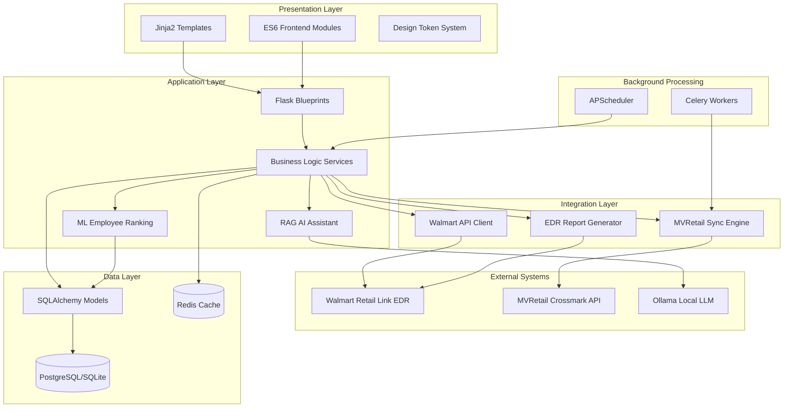
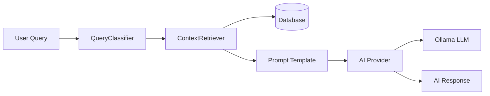
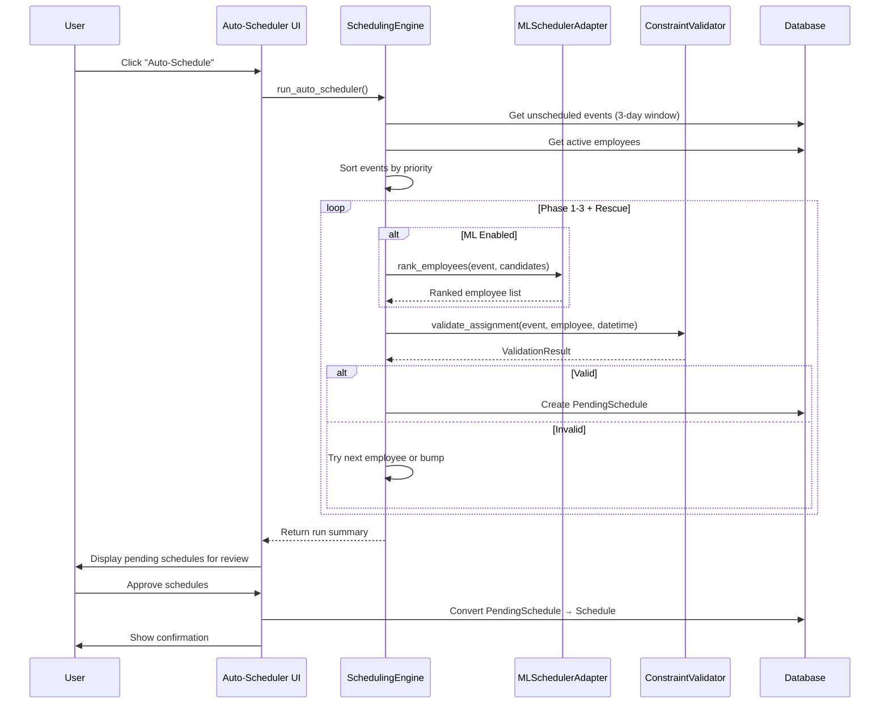
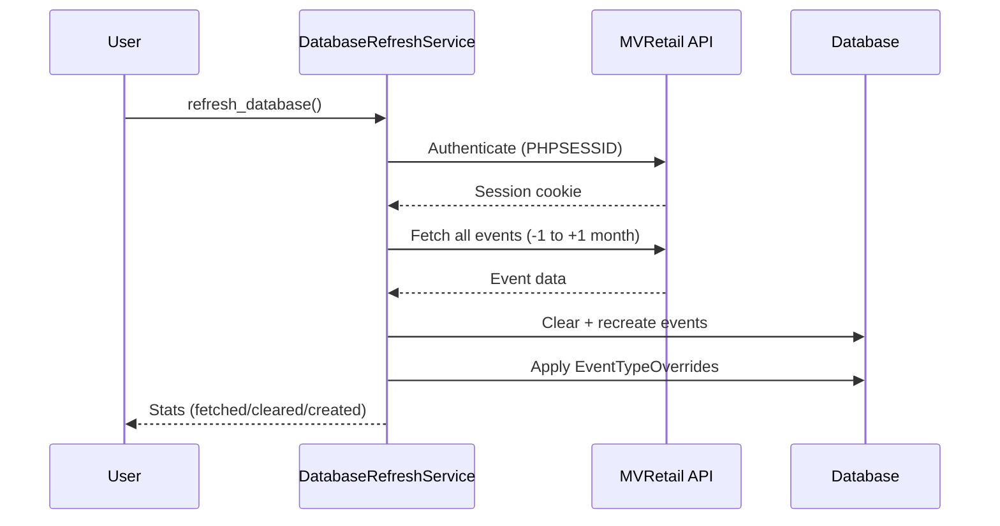
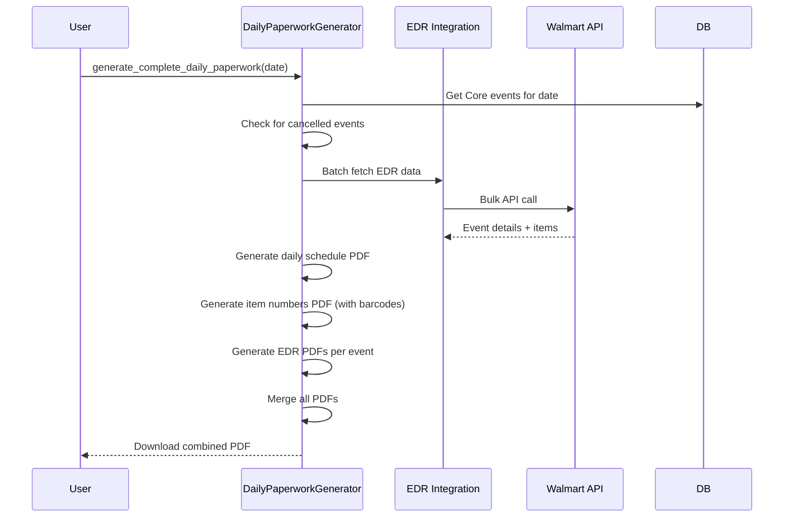

# Codebase Map: Flask Schedule Webapp

> Updated 2026-02-09

## System Overview

Flask Schedule Webapp is a **production-grade employee scheduling system** for Crossmark that manages event scheduling, employee availability, and integrates with external systems (Walmart Retail Link EDR, MVRetail API). It features an intelligent auto-scheduler with rotation management, ML-enhanced employee ranking, RAG-based AI assistant powered by local LLMs, inventory tracking, and comprehensive PDF report generation.

**Tech Stack**: Flask 3.0, SQLAlchemy, PostgreSQL/SQLite, Celery, Redis, Ollama AI, XGBoost/LightGBM ML
**Architecture**: Application Factory Pattern, Model Registry, Blueprint-based routing
**Deployment**: Docker Compose, Cloudflare Tunnel, Nginx, Gunicorn



## Directory Structure

```
flask-schedule-webapp/
├── app/                          # Main application package
│   ├── __init__.py              # Application factory (2,520 tokens)
│   ├── config.py                # Environment configs with ML settings (2,209 tokens)
│   ├── constants.py             # Event types, dept codes, club details (46,015 tokens)
│   ├── extensions.py            # Flask extensions init (167 tokens)
│   │
│   ├── models/                  # SQLAlchemy models (Factory Pattern) — 17 files
│   │   ├── __init__.py          # Model factory orchestrator (30 models)
│   │   ├── registry.py          # Centralized model access (get_models/get_db)
│   │   ├── employee.py          # Employee model (925 tokens)
│   │   ├── event.py             # Work event/task model (1,812 tokens)
│   │   ├── schedule.py          # Event-employee assignment (478 tokens)
│   │   ├── availability.py      # Availability, time-off, overrides (1,286 tokens)
│   │   ├── auto_scheduler.py    # Rotations, pending schedules, locked days (3,272 tokens)
│   │   ├── system_setting.py    # System settings with encryption (690 tokens)
│   │   ├── audit.py             # Audit logs & notification settings (645 tokens)
│   │   ├── employee_attendance.py # Attendance tracking (904 tokens)
│   │   ├── paperwork_template.py  # Paperwork templates (467 tokens)
│   │   ├── user_session.py      # Database-backed session management (1,451 tokens)
│   │   ├── company_holiday.py   # Company holidays with recurrence (1,069 tokens)
│   │   ├── ignored_validation_issue.py # Validation issue suppressions (740 tokens)
│   │   ├── shift_block_setting.py     # 8 shift block configuration (1,574 tokens)
│   │   ├── notes.py             # Notes & recurring reminders (2,011 tokens)
│   │   └── inventory.py         # Supply tracking (6 models, 3,118 tokens)
│   │
│   ├── routes/                  # Flask blueprints — 28 files
│   │   ├── __init__.py          # Auth helpers (is_authenticated, require_authentication)
│   │   ├── api.py               # Main REST API (46,716 tokens)
│   │   ├── admin.py             # Admin functions (24,490 tokens)
│   │   ├── auto_scheduler.py    # Auto-scheduler interface (15,233 tokens)
│   │   ├── printing.py          # PDF generation (14,488 tokens)
│   │   ├── dashboard.py         # Validation dashboards (8,120 tokens)
│   │   ├── employees.py         # Employee CRUD (7,287 tokens)
│   │   ├── main.py              # Dashboard, calendar views (6,508 tokens)
│   │   ├── scheduling.py        # Scheduling operations (6,595 tokens)
│   │   ├── auth.py              # Authentication, session mgmt (4,640 tokens)
│   │   ├── api_notes.py         # Notes API (5,127 tokens)
│   │   ├── api_attendance.py    # Attendance API (3,651 tokens)
│   │   ├── inventory.py         # Inventory management (3,839 tokens)
│   │   ├── api_paperwork_templates.py # Paperwork templates API (2,823 tokens)
│   │   ├── api_shift_blocks.py  # Shift block settings API (2,624 tokens)
│   │   ├── api_auto_scheduler_settings.py # Scheduler settings API (2,288 tokens)
│   │   ├── ai_routes.py         # AI assistant API (2,215 tokens)
│   │   ├── api_notifications.py # Notifications API (1,939 tokens)
│   │   ├── api_company_holidays.py # Company holidays API (2,255 tokens)
│   │   ├── api_employee_termination.py # Employee termination (1,987 tokens)
│   │   ├── api_locked_days.py   # Locked days API (2,175 tokens)
│   │   ├── api_availability_overrides.py # Availability overrides (1,957 tokens)
│   │   ├── api_suggest_employees.py # Employee suggestion (1,816 tokens)
│   │   ├── api_validate_schedule.py # Schedule validation (1,293 tokens)
│   │   ├── edr_sync.py          # EDR sync (1,508 tokens)
│   │   ├── rotations.py         # Rotation assignments (1,546 tokens)
│   │   ├── health.py            # Health check + Prometheus metrics (1,317 tokens)
│   │   └── help.py              # Help documentation (457 tokens)
│   │
│   ├── services/                # Business logic layer — 24 files
│   │   ├── scheduling_engine.py      # Auto-scheduler orchestrator (36,079 tokens)
│   │   ├── ai_tools.py               # LLM function calling (29,595 tokens)
│   │   ├── schedule_verification.py  # Daily validation (17,755 tokens)
│   │   ├── daily_paperwork_generator.py # PDF packaging (12,744 tokens)
│   │   ├── weekly_validation.py      # Cross-day validation (7,160 tokens)
│   │   ├── daily_audit_checker.py    # Proactive issue detection (5,290 tokens)
│   │   ├── approved_events_service.py # Approved events (5,407 tokens)
│   │   ├── shift_block_config.py     # Shift block configuration (5,556 tokens)
│   │   ├── database_refresh_service.py # Database refresh (4,837 tokens)
│   │   ├── constraint_validator.py   # Business rules (4,608 tokens)
│   │   ├── inventory_service.py      # Inventory operations (4,393 tokens)
│   │   ├── ai_assistant.py           # AI chat orchestration (4,203 tokens)
│   │   ├── edr_service.py            # EDR service (3,701 tokens)
│   │   ├── edr_generator.py          # EDR report generation (4,405 tokens)
│   │   ├── conflict_validation.py    # Conflict validation (3,426 tokens)
│   │   ├── employee_import_service.py # Employee import (3,372 tokens)
│   │   ├── command_center_service.py # Command center dashboard (3,324 tokens)
│   │   ├── sync_service.py           # MVRetail sync (3,074 tokens)
│   │   ├── event_time_settings.py    # Event time config (2,979 tokens)
│   │   ├── rotation_manager.py       # Rotation assignments (2,338 tokens)
│   │   ├── conflict_resolver.py      # Event bumping logic (1,654 tokens)
│   │   ├── workload_analytics.py     # Workload analytics (851 tokens)
│   │   └── validation_types.py       # Validation type defs (663 tokens)
│   │
│   ├── ai/                      # RAG-based AI assistant — 9 files
│   │   ├── config.py            # AI configuration (478 tokens)
│   │   ├── routes.py            # AI RAG endpoints /api/ai/rag (998 tokens)
│   │   ├── context/
│   │   │   ├── classifier.py    # Query type detection (1,565 tokens)
│   │   │   └── retriever.py     # Database context retrieval (2,420 tokens)
│   │   ├── providers/
│   │   │   ├── base.py          # Abstract provider interface (331 tokens)
│   │   │   └── ollama.py        # Local LLM integration (1,064 tokens)
│   │   ├── prompts/
│   │   │   └── templates.py     # LLM prompt templates (710 tokens)
│   │   └── services/
│   │       └── chat.py          # Chat service (1,269 tokens)
│   │
│   ├── ml/                      # Machine Learning module — 11 files
│   │   ├── __init__.py          # Module metadata v0.1.0 (80 tokens)
│   │   ├── features/
│   │   │   ├── employee_features.py      # Employee feature extraction (2,648 tokens)
│   │   │   ├── event_features.py         # Event feature extraction (2,463 tokens)
│   │   │   ├── historical_features.py    # Historical data features (2,073 tokens)
│   │   │   └── simple_employee_features.py # Simplified features (1,318 tokens)
│   │   ├── models/
│   │   │   ├── employee_ranker.py    # XGBoost/LightGBM model (1,941 tokens)
│   │   │   └── artifacts/            # Trained model storage (.pkl)
│   │   ├── training/
│   │   │   ├── train_employee_ranker.py  # Training script (2,018 tokens)
│   │   │   └── data_preparation.py       # Training data prep (2,379 tokens)
│   │   ├── inference/
│   │   │   └── ml_scheduler_adapter.py   # SchedulingEngine integration (1,972 tokens)
│   │   └── evaluation/
│   │       └── metrics.py            # Evaluation metrics (2,227 tokens)
│   │
│   ├── integrations/            # External system clients
│   │   ├── walmart_api/         # Walmart Retail Link
│   │   │   ├── routes.py        # Walmart endpoints (10,341 tokens)
│   │   │   ├── authenticator.py # MFA auth flow (3,249 tokens)
│   │   │   └── session_manager.py # Per-user sessions (1,327 tokens)
│   │   ├── external_api/        # MVRetail Crossmark
│   │   │   ├── session_api_service.py  # API client (14,362 tokens)
│   │   │   ├── sync_engine.py          # Bidirectional sync (6,348 tokens)
│   │   │   └── parallel_session_api.py # Parallel session handling (2,064 tokens)
│   │   └── edr/                 # EDR report generation
│   │       ├── report_generator.py     # EDR data fetching (15,661 tokens)
│   │       ├── pdf_generator_base.py   # Base PDF layout (10,502 tokens)
│   │       ├── pdf_generator.py        # EDR PDF creation (9,953 tokens)
│   │       └── db_manager.py           # SQLite cache (3,331 tokens)
│   │
│   ├── error_handlers/          # Centralized error handling
│   │   ├── __init__.py          # Error handler registration (546 tokens)
│   │   ├── exceptions.py        # Custom exception hierarchy (980 tokens)
│   │   ├── decorators.py        # @handle_errors, @with_db_transaction (814 tokens)
│   │   └── logging.py           # Structured logging (2,028 tokens)
│   │
│   ├── utils/                   # Utility functions
│   │   ├── db_helpers.py        # Query optimizations, @with_models (1,502 tokens)
│   │   ├── db_compat.py         # SQLite/PostgreSQL compatibility (643 tokens)
│   │   ├── event_helpers.py     # Event processing, Core-Supervisor pairing (3,734 tokens)
│   │   ├── validators.py        # Validation functions (915 tokens)
│   │   └── encryption.py        # Fernet encryption (706 tokens)
│   │
│   ├── static/                  # Frontend assets
│   │   ├── js/                  # JavaScript — 37 files
│   │   │   ├── main.js          # Dashboard, import/export, conflict detection (7,362 tokens)
│   │   │   ├── employees.js     # Employee management + MVRetail import (6,972 tokens)
│   │   │   ├── login.js         # Login page with retry logic (3,650 tokens)
│   │   │   ├── navigation.js    # Dropdown + mobile nav (897 tokens)
│   │   │   ├── search.js        # Search functionality (2,360 tokens)
│   │   │   ├── database-refresh.js  # Database refresh (1,329 tokens)
│   │   │   ├── notifications.js # Notifications panel (1,355 tokens)
│   │   │   ├── user_dropdown.js # User dropdown (640 tokens)
│   │   │   ├── loading-progress.js  # Loading progress (1,595 tokens)
│   │   │   ├── csrf_helper.js   # Auto CSRF for jQuery/Fetch/XHR (1,212 tokens)
│   │   │   ├── utils/           # API client, cache, debounce, a11y — 6 files
│   │   │   ├── modules/         # State mgr, validation, toast, ARIA — 5 files
│   │   │   ├── components/      # Modals, AI chat, conflict validator — 9 files
│   │   │   └── pages/           # Page-specific controllers — 7 files
│   │   │       └── daily-view.js    # Daily view (30,244 tokens)
│   │   └── css/                 # Stylesheets — 23 files
│   │       ├── design-tokens.css    # Design system tokens (2,818 tokens)
│   │       ├── style.css        # Main styles (11,437 tokens)
│   │       ├── responsive.css   # Responsive breakpoints (6,117 tokens)
│   │       ├── components/      # Component styles — 4 files
│   │       └── pages/           # Page-specific styles — 8 files
│   │
│   └── templates/               # Jinja2 templates — 50 files
│       ├── base.html            # Master template (5,973 tokens)
│       ├── index.html           # Dashboard (15,755 tokens)
│       ├── daily_view.html      # Daily schedule view (4,946 tokens)
│       ├── settings.html        # Settings page (11,075 tokens)
│       ├── components/          # Template components — 5 files
│       ├── dashboard/           # Validation dashboards — 4 files
│       ├── employees/           # Employee management — 2 files
│       ├── inventory/           # Inventory pages — 3 files
│       ├── help/                # User guides — 11 files
│       └── auth/                # Auth templates — 1 file
│
├── tests/                       # Pytest test suite — 13 files
│   ├── conftest.py              # Fixtures (app, client, db_session, models)
│   ├── test_models.py           # Model logic tests
│   ├── test_routes.py           # Endpoint tests
│   ├── test_scheduling_engine.py     # Auto-scheduler tests
│   ├── test_validator.py             # Validation tests
│   ├── test_rotation_manager_backup.py    # Rotation backup tests
│   ├── test_scheduling_backup_rotation.py # Backup rotation tests
│   ├── test_scheduling_past_dates.py      # Past date tests
│   ├── test_ml_functional.py         # ML functional tests
│   ├── test_ml_effectiveness.py      # ML effectiveness tests
│   ├── test_ml_performance.py        # ML performance tests
│   ├── test_ml_safety.py             # ML safety tests
│   └── test_ml_shadow_mode.py        # ML shadow mode tests
│
├── migrations/versions/         # Alembic database migrations — 20 files
│
├── scripts/                     # Utility scripts — 7 files
│   ├── backup_database.py       # Automated backups
│   ├── restore_database.py      # Backup restoration
│   ├── debug_api_event.py       # API debugging
│   ├── fix_event_types.py       # Event type fixes
│   ├── analyze_shadow_mode.py   # ML shadow mode analysis
│   ├── collect_ml_metrics.py    # ML metrics collection
│   └── generate_ml_report.py    # ML report generation
│
├── docs/                        # Documentation
│   ├── CODEBASE_MAP.md          # This file
│   ├── scheduling_validation_rules.md
│   ├── UI_UX_DESIGN_DOCUMENT.md
│   ├── UI_UX_FLAWS_DOCUMENT.md
│   ├── color-contrast-audit.md
│   └── plans/                   # Implementation plans — 6 files
│
├── deployment/                  # Deployment configurations
│   ├── docker/                  # Docker Compose, Dockerfiles
│   ├── nginx/                   # Nginx reverse proxy configs
│   ├── systemd/                 # systemd service files
│   └── CLOUDFLARE_*.md          # Cloudflare tunnel setup guides
│
├── wsgi.py                      # Application entry point
├── gunicorn_config.py           # WSGI server config (1 gevent worker)
├── celery_worker.py             # Background task worker
├── requirements.txt             # Python dependencies (~30 core packages)
├── pytest.ini                   # Test configuration
├── CLAUDE.md                    # AI assistant instructions
├── AGENTS.md                    # Agent-specific guidance
├── backup_now.sh                # Quick backup script
├── start_test_instance.sh       # Test instance (port 8001)
├── setup_ml.sh                  # ML setup script
└── test_ml_integration.py       # ML integration test
```

## Core Module Guide

### Application Foundation

**Entry Point**: `app/__init__.py:create_app()`

| File | Purpose | Tokens |
|------|---------|--------|
| `app/__init__.py` | App factory, blueprint registration, extensions | 2,520 |
| `app/config.py` | Environment-based configuration with feature flags | 2,209 |
| `app/extensions.py` | Flask extension initialization (db, migrate, csrf, limiter) | 167 |
| `app/constants.py` | Event types, department codes, Walmart fiscal weeks, club details | 46,015 |

**Key Features**:
- Application factory pattern for different environments (dev/test/prod)
- Model registry pattern via `model_registry` (replaces deprecated `app.config` storage)
- Blueprint-based modular architecture (24 blueprints)
- APScheduler for background tasks
- ProxyFix middleware for Cloudflare Tunnel
- Feature flags: `SYNC_ENABLED`, `ML_ENABLED`, `ENABLE_EDR_FEATURES`
- SQLite foreign key constraints enabled via SQLAlchemy event listener

**Configuration Classes**:
```
DevelopmentConfig:  SQLite, random SECRET_KEY, debug=True
TestingConfig:      In-memory SQLite, SYNC_ENABLED=False
ProductionConfig:   PostgreSQL, strong SECRET_KEY (≥32 chars required), validation enabled
```

**Gotchas**:
- Dev mode generates random SECRET_KEY on each restart (sessions don't persist)
- Rate limiter uses in-memory storage (not suitable for multi-worker)
- Auto-scheduler blueprint exempt from rate limiting (makes many API calls)

---

### Models (Database Layer)

**Architecture**: Factory functions returning model classes — accessed via `get_models()`

**Entry Point**: `app/models/__init__.py:init_models(db)`

**Core Models (30 total)**:

| Model | File | Purpose | Key Fields |
|-------|------|---------|------------|
| Employee | employee.py | Staff/representatives | name, job_title, is_active, external_id, juicer_trained |
| Event | event.py | Work tasks/visits | project_ref_num, start/due_datetime, event_type, edr_status |
| Schedule | schedule.py | Event-employee assignments | event_ref_num, employee_id, schedule_datetime, shift_block |
| EmployeeWeeklyAvailability | availability.py | Recurring weekly pattern | monday-sunday booleans |
| EmployeeAvailability | availability.py | Date-specific override | employee_id, date, is_available |
| EmployeeTimeOff | availability.py | Time-off requests | start_date, end_date |
| EmployeeAvailabilityOverride | availability.py | Temporary weekly change | employee_id, per-day overrides (NULL = no change) |
| RotationAssignment | auto_scheduler.py | Weekly rotations with backup | day_of_week, rotation_type, employee_id, backup_employee_id |
| PendingSchedule | auto_scheduler.py | Auto-scheduler proposals | scheduler_run_id, status, bumped_event_ref_num |
| SchedulerRunHistory | auto_scheduler.py | Run audit trail | run_id, status, metrics |
| ScheduleException | auto_scheduler.py | One-time rotation override | exception_date, rotation_type, employee_id |
| EventSchedulingOverride | auto_scheduler.py | Per-event auto-scheduler control | event, settings |
| LockedDay | auto_scheduler.py | Prevent schedule modifications | date, reason |
| EventTypeOverride | auto_scheduler.py | Manual event type override (persists through DB refresh) | event, override_type |
| SystemSetting | system_setting.py | DB-backed config with encryption | key, value, setting_type (string/boolean/encrypted) |
| CompanyHoliday | company_holiday.py | Holidays with recurrence | holiday_date, is_recurring, recurring_rule |
| ShiftBlockSetting | shift_block_setting.py | 8 shift blocks | block_number, arrive_time, on_floor_time, lunch_time, depart_time |
| Note / RecurringReminder | notes.py | Task/note tracking | title, content, priority, due_date, frequency |
| SupplyCategory / Supply / SupplyAdjustment / PurchaseOrder / OrderItem / InventoryReminder | inventory.py | Inventory management (6 models) | Various |

**Availability Hierarchy** (checked in order):
1. `EmployeeAvailabilityOverride` (temporary weekly change — highest priority)
2. `EmployeeAvailability` (date-specific)
3. `EmployeeWeeklyAvailability` (recurring pattern)
4. `EmployeeTimeOff` (date range unavailability)

**Business Logic on Models**:
- `Employee.can_work_event_type(event_type)` — Role-based event restrictions
- `Event.detect_event_type()` — Auto-classify from project_name (keywords → duration fallback)
- `CompanyHoliday.is_holiday(check_date)` — Check if date is holiday (handles recurrence)
- `SystemSetting.get_setting(key, default)` — Retrieve with type conversion + encryption

---

### Services (Business Logic)

#### SchedulingEngine (36,079 tokens)
**File**: `app/services/scheduling_engine.py`

**Purpose**: Auto-scheduler orchestrator with multi-phase priority algorithm

**Algorithm**:
```
Phase 1: Rotation Events (Juicer, Digital) → Rotation employees
Phase 2: Core Events (Lead priority) → 8 shift blocks
Phase 3: Supervisor Events → Auto-pair with Core (parent_event_ref_num)
Rescue:  Urgent events due within 3 days
```

**Key Configuration**:
- `SCHEDULING_WINDOW_DAYS = 3` (only schedules 3 days ahead)
- `MAX_BUMPS_PER_EVENT = 3` (prevents infinite bump loops)
- Shift block times loaded from database (`ShiftBlockConfig`)
- ML integration via `MLSchedulerAdapter` (optional, graceful fallback)

**Dependencies**: RotationManager, ConstraintValidator, ConflictResolver, ShiftBlockConfig, MLSchedulerAdapter

---

#### ConstraintValidator (4,608 tokens)
**File**: `app/services/constraint_validator.py`

**Constraints Checked** (in order):
1. Company holidays
2. Time-off requests
3. Weekly availability patterns
4. Role requirements (Lead-only event types)
5. Daily limit (max 1 Core event per day)
6. Weekly limit (max 6 Core events per week, Sun-Sat)
7. Already scheduled (overlap detection)
8. Due date (must schedule before event due)

**Business Rules**:
- **Lead-Only**: Freeosk, Digitals, Digital Setup/Refresh/Teardown require Lead Event Specialist or Club Supervisor
- **Juicer**: Requires Juicer Barista job title OR `juicer_trained=True`
- Must call `set_current_run(run_id)` to include pending schedules in validation

---

#### ConflictResolver (1,654 tokens)
**File**: `app/services/conflict_resolver.py`

- Priority score = days until due date (lower = more urgent)
- Never bump events within 2 days of due date
- Never bump Supervisor events (paired with Core)
- Returns `SwapProposal` objects

---

#### Schedule Verification Services

| Service | File | Tokens | Purpose |
|---------|------|--------|---------|
| ScheduleVerificationService | schedule_verification.py | 17,755 | Daily validation (~8 rules), range verification |
| WeeklyValidationService | weekly_validation.py | 7,160 | Cross-day validation, health score (0-100) |
| DailyAuditChecker | daily_audit_checker.py | 5,290 | Proactive issue detection, rotation gaps, deadline warnings |

**Health Score**: `100 - (critical × 10) - (warning × 3)` — Range 0-100

---

#### Additional Services

| Service | File | Tokens | Purpose |
|---------|------|--------|---------|
| AI Tools | ai_tools.py | 29,595 | LLM function calling tools |
| Daily Paperwork | daily_paperwork_generator.py | 12,744 | PDF packaging for daily reports |
| Shift Block Config | shift_block_config.py | 5,556 | Shift block time configuration |
| Approved Events | approved_events_service.py | 5,407 | Walmart-approved event tracking |
| Database Refresh | database_refresh_service.py | 4,837 | Full refresh from MVRetail API |
| EDR Generator | edr_generator.py | 4,405 | EDR report generation |
| Inventory | inventory_service.py | 4,393 | Inventory CRUD + order workflow |
| AI Assistant | ai_assistant.py | 4,203 | AI chat orchestration |
| EDR Service | edr_service.py | 3,701 | EDR orchestration |
| Conflict Validation | conflict_validation.py | 3,426 | Schedule conflict checking |
| Employee Import | employee_import_service.py | 3,372 | Employee import from MVRetail |
| Command Center | command_center_service.py | 3,324 | Morning briefing dashboard data |
| Sync Service | sync_service.py | 3,074 | MVRetail sync orchestration (Celery tasks) |
| Event Time Settings | event_time_settings.py | 2,979 | Allowed time slots per event type |
| Rotation Manager | rotation_manager.py | 2,338 | Rotation assignments + exceptions |

---

### Routes (Flask Blueprints)

**24 blueprints** organized by feature:

| Blueprint | Prefix | File | Tokens | Purpose |
|-----------|--------|------|--------|---------|
| `api_bp` | `/api` | api.py | 46,716 | Main REST API |
| `admin_bp` | `/` | admin.py | 24,490 | Admin, DB refresh, sync, webhooks |
| `auto_scheduler_bp` | `/auto-schedule` | auto_scheduler.py | 15,233 | Auto-scheduler approval workflow |
| `printing_bp` | `/printing` | printing.py | 14,488 | PDF generation |
| `walmart_bp` | `/api/walmart` | walmart_api/routes.py | 10,341 | Walmart EDR integration |
| `dashboard_bp` | `/dashboard` | dashboard.py | 8,120 | Command center, daily/weekly validation |
| `employees_bp` | `/` | employees.py | 7,287 | Employee CRUD + MVRetail import |
| `scheduling_bp` | `/` | scheduling.py | 6,595 | Schedule form, available employees |
| `main_bp` | `/` | main.py | 6,508 | Dashboard, calendar, unscheduled |
| `api_notes_bp` | `/api/notes` | api_notes.py | 5,127 | Notes API |
| `auth_bp` | `/` | auth.py | 4,640 | Login, session, timeout |
| `inventory_bp` | `/inventory` | inventory.py | 3,839 | Inventory management |
| `attendance_api_bp` | `/api/attendance` | api_attendance.py | 3,651 | Attendance API |
| `api_paperwork_templates_bp` | `/api/paperwork-templates` | api_paperwork_templates.py | 2,823 | Paperwork templates |
| `api_shift_blocks_bp` | `/api/shift-blocks` | api_shift_blocks.py | 2,624 | Shift block settings |
| `api_auto_scheduler_settings_bp` | `/api` | api_auto_scheduler_settings.py | 2,288 | Scheduler settings |
| `api_company_holidays_bp` | `/api/company-holidays` | api_company_holidays.py | 2,255 | Company holidays |
| `ai_bp` | `/api/ai` | ai_routes.py | 2,215 | AI assistant (legacy + RAG) |
| `api_locked_days_bp` | `/api/locked-days` | api_locked_days.py | 2,175 | Locked days |
| `api_employee_termination_bp` | `/api` | api_employee_termination.py | 1,987 | Employee termination |
| `api_availability_overrides_bp` | `/api` | api_availability_overrides.py | 1,957 | Availability overrides |
| `notifications_api_bp` | `/api/notifications` | api_notifications.py | 1,939 | Notifications |
| `api_suggest_employees_bp` | `/api` | api_suggest_employees.py | 1,816 | Employee suggestion |
| `rotations_bp` | `/rotations` | rotations.py | 1,546 | Rotation assignments |
| `edr_sync_bp` | `/api/sync` | edr_sync.py | 1,508 | EDR sync |
| `health_bp` | `/health` | health.py | 1,317 | Health check + Prometheus metrics |
| `api_validate_schedule_bp` | `/api` | api_validate_schedule.py | 1,293 | Schedule validation |
| `help_bp` | `/help` | help.py | 457 | Help documentation (11 pages) |

**Common Patterns**:
- `@require_authentication()` decorator for protected routes
- CSRF protection on all POST/PUT/DELETE (except webhooks — needs HMAC)
- JSON responses: `{'success': True, 'data': {...}}` / `{'success': False, 'error': '...'}`
- Rate limiting on login (5/min)
- Row-level locking (`with_for_update()`) for concurrent approval safety

**Key Route Gotchas**:
- **Superseded PendingSchedules**: Bumped events create `superseded` status — MUST skip during approval
- **Locked days**: Check BOTH target date AND bump source date
- **External IDs**: Use `employee.external_id` (numeric repId) for MVRetail API, not `employee.id`
- **Commit isolation**: Commit Core event BEFORE attempting Supervisor scheduling

---

### AI Module

**Location**: `app/ai/`

**Architecture**: RAG pipeline — Query → Classify → Retrieve Context → Generate Answer



| Component | File | Tokens | Purpose |
|-----------|------|--------|---------|
| QueryClassifier | context/classifier.py | 1,565 | Determine query intent |
| ContextRetriever | context/retriever.py | 2,420 | Fetch relevant DB records |
| PromptTemplates | prompts/templates.py | 710 | LLM prompt engineering |
| OllamaProvider | providers/ollama.py | 1,064 | Local LLM integration |
| ChatService | services/chat.py | 1,269 | Orchestration layer |

**AI Providers**: Ollama (default, free), Google Gemini, OpenAI, Anthropic Claude
**Endpoints**: `/api/ai/rag/chat` (JSON), `/api/ai/rag/chat/stream` (SSE), `/api/ai/query` (legacy)

---

### ML Module

**Location**: `app/ml/`

**Purpose**: ML-enhanced employee ranking for auto-scheduler

| Component | File | Tokens | Purpose |
|-----------|------|--------|---------|
| EmployeeFeatureExtractor | features/employee_features.py | 2,648 | Role, performance, workload |
| EventFeatureExtractor | features/event_features.py | 2,463 | Event type, date, duration |
| HistoricalFeatureExtractor | features/historical_features.py | 2,073 | Past assignment success rates |
| EmployeeRanker | models/employee_ranker.py | 1,941 | XGBoost/LightGBM model |
| MLSchedulerAdapter | inference/ml_scheduler_adapter.py | 1,972 | SchedulingEngine integration |

**Feature Flags**: `ML_ENABLED`, `ML_SHADOW_MODE`, `ML_CONFIDENCE_THRESHOLD=0.6`
**Safety**: All ML methods fallback to rule-based logic on failure. Shadow mode logs without acting.

---

### Integrations

#### Walmart Retail Link API (`app/integrations/walmart_api/`)
- **Auth**: 6-step MFA flow with SMS OTP
- **Sessions**: Per-user with 10-minute timeout
- **Operations**: EDR reports, approved events, event rolling, batch PDF generation
- **Cache**: 24-hour file-based cache for EDR data

#### MVRetail Crossmark API (`app/integrations/external_api/`)
- **Auth**: PHPSESSID cookie-based session (auto-refresh every 3600s)
- **Retry**: 3 retries with backoff for 429/500/502/503/504
- **Sync**: Bidirectional — events/employees from API, schedules to API
- **Key**: `session_api_service.py` (14,362 tokens) handles all API calls

#### EDR Report Generation (`app/integrations/edr/`)
- **Cache**: SQLite-based offline cache (`db_manager.py`)
- **PDF**: ReportLab-based PDF generation with event details + barcodes
- **Bulk**: Single auth → 50+ reports without re-auth

---

### Frontend Architecture

**Pattern**: Hybrid server-rendered Jinja2 + ES6 modules with design token system

#### Design Token System (`app/static/css/design-tokens.css`)

| Token Category | Description |
|----------------|-------------|
| Color Palette | Brand (PC Navy #2E4C73, PC Blue #1B9BD8), semantic, neutrals (11-step) |
| Event Type Colors | Juicer (#FF6B6B), Digital (#4ECDC4), Core (#95E1D3), etc. |
| Role Badge Colors | Lead (Hot Pink), Supervisor (Dark Cyan), Juicer (Orange), Specialist (Green) |
| Typography | Outfit font, 14px minimum body, 8 size steps (xs-3xl) |
| Spacing | 4px grid system (--space-1 through --space-20) |
| Component Tokens | Buttons (40px height), inputs (40px), modals, navigation (60px) |
| Shadows | 5 levels (xs through xl, rgba-based) |
| Z-Index Layers | base(1) → dropdown(1000) → modal(1050) → notification(1080) → loading-overlay(10000) |
| Accessibility | .sr-only, .skip-to-content, prefers-reduced-motion support |

#### CSS Layer Order
```
design-tokens.css     → Design system variables
style.css             → Global styles using tokens
components/*.css      → Component styles (modal, schedule-modal, ai-chat, notification-modal)
pages/*.css           → Page styles (index, daily-view, employees, auto-schedule-review, etc.)
responsive.css        → Responsive breakpoints (640/768/1024/1280px)
```

#### JavaScript Module System

| Category | Files | Purpose |
|----------|-------|---------|
| **Utils** (6) | api-client.js, cache-manager.js, debounce.js, loading-state.js, focus-trap.js, sr-announcer.js | HTTP client, caching, performance, a11y |
| **Modules** (5) | state-manager.js, validation-engine.js, toast-notifications.js, aria-announcer.js, focus-trap.js | Core infrastructure |
| **Components** (9) | modal.js, schedule-modal.js, reschedule-modal.js, trade-modal.js, change-employee-modal.js, notification-modal.js, conflict-validator.js, ai-chat.js, ai-assistant.js | Reusable UI components |
| **Pages** (7) | daily-view.js (30k tokens), daily-view-attendance-methods.js, attendance-calendar.js, schedule-form.js, schedule-verification.js, dashboard.js, workload-dashboard.js | Page controllers |

**Key Patterns**:
- **Global singletons**: `apiClient`, `stateManager`, `toaster` exposed on `window` for hybrid ES6/legacy compat
- **State management**: localStorage (persistent prefs), sessionStorage (filters), History API (shareable URLs)
- **CSRF protection**: `csrf_helper.js` auto-injects tokens into jQuery, Fetch, and XMLHttpRequest
- **Accessibility**: Focus traps, ARIA live regions, keyboard navigation, screen reader announcements

---

## Data Flow

### Auto-Scheduler Workflow



### Database Refresh Flow



### Daily Paperwork Generation



---

## Event Types & Scheduling Priority

| Event Type | Default Duration | Priority | Special Rules |
|------------|------------------|----------|---------------|
| Juicer Production | 540 min (9h) | 1 (Highest) | Rotation employee only, Juicer Barista or juicer_trained |
| Digital Setup | 30 min | 2 | Rotation employee priority, Lead/Supervisor |
| Digital Refresh | 15 min | 3 | Rotation employee priority, Lead/Supervisor |
| Freeosk | 15 min | 4 | Lead Event Specialist or Club Supervisor |
| Digital Teardown | 15 min | 5 | Lead or Club Supervisor |
| Core | 390 min (6.5h) | 6 | Max 1/day, max 6/week per employee |
| Supervisor | 5 min | 7 | Auto-paired with Core (30 min after Core start) |
| Digitals | 15 min | 8 | Lead or Club Supervisor |
| Other | 15 min | 9 (Lowest) | Any active employee |

---

## Validation Rules

### Daily Validation (~8 Core Rules)

| Rule | Severity | Description |
|------|----------|-------------|
| Time off conflicts | Critical | Employee scheduled during time-off |
| Double booking | Critical | Overlapping event assignments |
| Primary Lead Block 1 | Warning | Primary Lead should have shift Block 1 |
| Max 1 Core/day | Critical | No more than 1 Core event per employee per day |
| Employee active | Critical | Employee must be active |
| Same time slot | Critical | Multiple events in same time slot |
| Juicer qualification | Critical | Juicer events to qualified employees |
| Digital qualification | Warning | Digital events to Lead/Supervisor |

### Weekly Validation (Additional Rules)

| Rule | Severity | Description |
|------|----------|-------------|
| Max 6 Core/week | Critical | Max 6 Core events per employee per week |
| Max 5 Juicer/week | Critical | Max 5 Juicer events per week |
| Schedule randomization | Warning | Not same time 4+ consecutive days |
| No duplicate products | Warning | Same product shouldn't repeat same day |
| Time slot distribution | Warning | 2-2-2-2 pattern across blocks |

### Health Score
```
Score = 100 - (critical × 10) - (warning × 3)
90-100: Excellent | 70-89: Good | 50-69: Fair | <50: Needs attention
```

---

## Deployment Architecture

```
Internet (HTTPS)
    ↓
Cloudflare Tunnel (zero-trust, DDoS protection, SSL)
    ↓
Nginx Reverse Proxy (static files, security headers)
    ↓
Gunicorn WSGI (1 gevent worker, 120s timeout, 10k max requests)
    ↓
  ┌──────────┐    ┌────────┐
  │PostgreSQL│    │ Redis  │
  │(15-alpine)│   │(7-alpine)│
  └──────────┘    └────────┘
       │
   Celery Worker (background sync tasks)
```

**Critical**: Single Gunicorn worker required — Walmart EDR MFA uses global session state.

---

## Testing Strategy

**13 test files** with function-level DB isolation:

```bash
pytest                              # All tests
pytest -v                           # Verbose
pytest --cov=app                    # With coverage
pytest -k "schedule"                # Pattern match
```

**Key Fixtures**: `app`, `client`, `db_session`, `models` (from `get_models()`)

**Coverage Areas**: Models, routes, scheduling engine, constraint validation, rotation management, ML (5 dedicated test files)

**Gaps**: No frontend JS tests (Jest), no E2E tests (Playwright), no integration tests for external APIs

---

## Navigation Guide

| Task | Files to Touch |
|------|----------------|
| **Add auto-scheduler rule** | `services/constraint_validator.py` → `services/scheduling_engine.py` → `tests/test_validator.py` |
| **Add event type** | `constants.py` → `models/event.py` (detect_event_type) → `services/event_time_settings.py` → `services/scheduling_engine.py` |
| **Add API endpoint** | `routes/api.py` or `routes/api_*.py` → `static/js/utils/api-client.js` → tests |
| **Add validation rule** | `services/schedule_verification.py` or `services/weekly_validation.py` → `docs/scheduling_validation_rules.md` |
| **Modify PDF reports** | `services/daily_paperwork_generator.py` → `integrations/edr/pdf_generator.py` |
| **Configure ML** | Set `ML_ENABLED=true` → Train: `python app/ml/training/train_employee_ranker.py` → Shadow mode first |
| **Add model** | `models/your_model.py` → `models/__init__.py` (register) → migration → service → route |
| **Add inventory items** | `models/inventory.py` → `services/inventory_service.py` → `routes/inventory.py` → `templates/inventory/` |

---

## Conventions

**Models**: PascalCase singular (`Employee`, `Event`)
**Files**: snake_case (`scheduling_engine.py`, `api_notes.py`)
**Functions**: snake_case (`run_auto_scheduler()`, `validate_assignment()`)
**Constants**: UPPER_SNAKE_CASE (`MAX_CORE_EVENTS_PER_DAY`)
**Blueprints**: snake_case with `_bp` suffix (`auto_scheduler_bp`)
**CSS tokens**: `--color-{category}`, `--font-size-{scale}`, `--space-{number}`, `--z-{layer}`

**API Response Format**:
```json
{"success": true, "data": {...}, "message": "Optional"}
{"success": false, "error": "Error message", "details": {...}}
```

---

## Gotchas

### Critical
1. **Model Access**: ALWAYS use `get_models()` — never direct imports (causes circular imports)
2. **Single Gunicorn Worker**: Required for EDR MFA global session state
3. **Supervisor Pairing**: Matches 6-digit event number prefix, requires date window overlap
4. **Shift Block Order**: First 8 sequential [1-8], overflow priority [1,3,5,7,2,4,6,8], Primary Lead always Block 1
5. **Scheduler Window**: Only schedules 3 days ahead
6. **Locked Days**: Check BOTH target date AND bump source date before approval
7. **Superseded PendingSchedules**: MUST skip during approval (bumped events)
8. **Trade events**: Use integer comparison for event IDs (recent fix for string/int mismatch)

### Configuration
1. **SECRET_KEY**: Must be ≥32 characters in production
2. **Timezone**: MVRetail requires `America/Indiana/Indianapolis`
3. **CSRF Sources**: Cookie → Meta tag → `window.getCsrfToken()`
4. **Encryption**: Auto-generates Fernet key on first use, persists to `.env`

### Performance
1. **daily-view.js**: ~160KB (30k tokens) — largest frontend file
2. **api.py**: ~246KB (47k tokens) — largest backend file
3. **N+1 queries**: Use `get_schedules_with_relations()` helper
4. **Design tokens**: Single source of truth — never hardcode colors

---

## External Dependencies

### Python (~30 core packages)
- **Framework**: Flask 3.0.3, Flask-SQLAlchemy 3.1.1, Flask-Migrate 4.0.5, Flask-WTF 1.2.1, Flask-Limiter 4.0.0
- **AI/ML**: ollama, google-generativeai, xgboost, scikit-learn, pandas, numpy
- **HTTP**: requests 2.32, gevent 24.2, celery 5.3, APScheduler 3.11
- **PDF**: reportlab 4.2, xhtml2pdf 0.2.16, PyPDF2 3.0, python-barcode
- **Database**: psycopg2-binary 2.9, redis 5.0
- **Security**: cryptography 42.0, python-decouple 3.8

### External Systems
| System | Purpose | Feature Flag |
|--------|---------|-------------|
| Walmart Retail Link | EDR reports, event rolling | `ENABLE_EDR_FEATURES` |
| MVRetail Crossmark | Event/employee sync | `SYNC_ENABLED` |
| Ollama | Local AI assistant | `AI_ENABLED` |
| PostgreSQL | Production database | Production only |
| Redis | Task queue, sessions | Production only |
| Cloudflare Tunnel | Remote access | Deployment only |

---

**Last Updated**: 2026-02-09
**Generated By**: Cartographer (Claude Code)
**Codebase Size**: 376 files, ~1,277,614 tokens
**Architecture**: Production-grade Flask application with AI + ML integration
