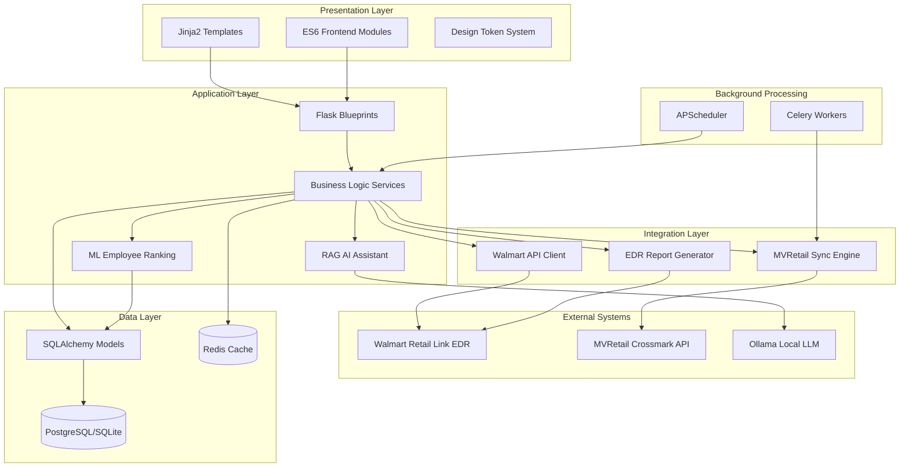
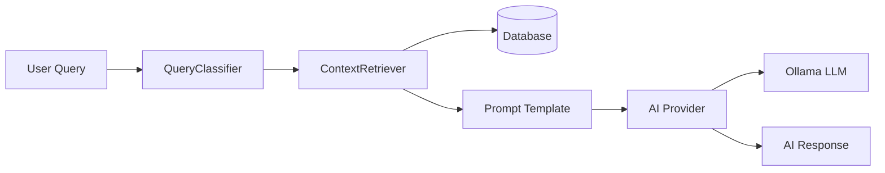
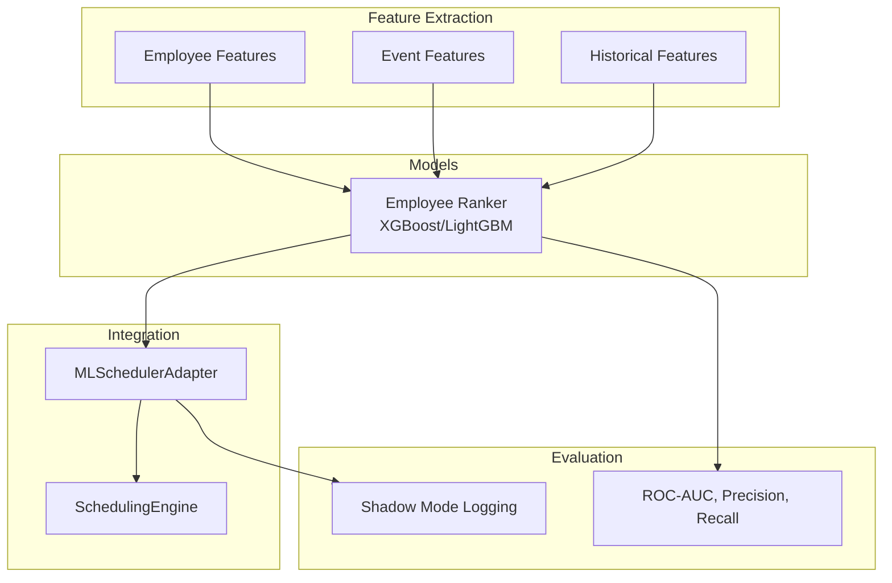
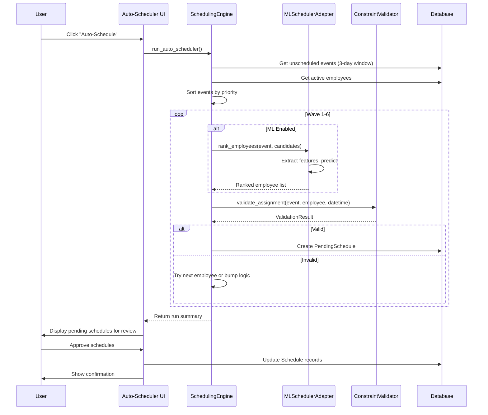
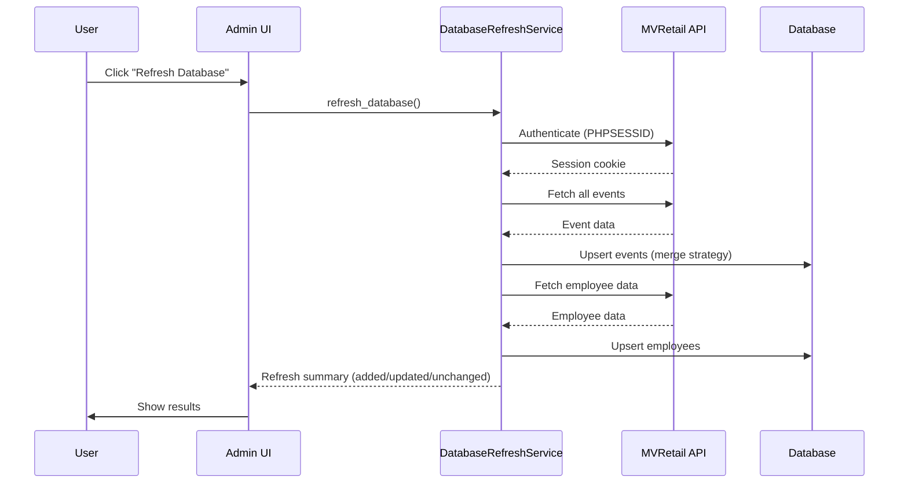
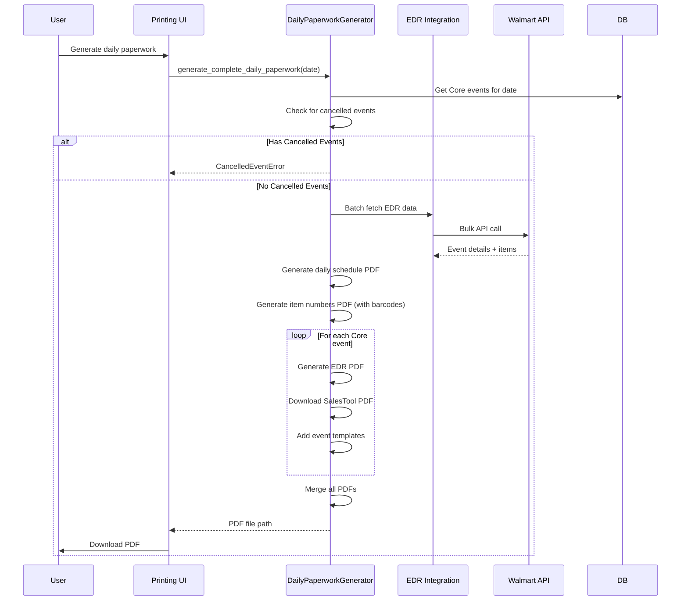

# Codebase Map: Flask Schedule Webapp

> Updated 2026-02-06

## System Overview

Flask Schedule Webapp is a **production-grade employee scheduling system** for Crossmark that manages event scheduling, employee availability, and integrates with external systems (Walmart Retail Link EDR, MVRetail API). It features an intelligent auto-scheduler with rotation management, ML-enhanced employee ranking, RAG-based AI assistant powered by local LLMs, inventory tracking, and comprehensive PDF report generation.

**Tech Stack**: Flask 3.0, SQLAlchemy, PostgreSQL/SQLite, Celery, Redis, Ollama AI, XGBoost/LightGBM ML
**Architecture**: Application Factory Pattern, Model Registry, Blueprint-based routing
**Deployment**: Docker Compose, Cloudflare Tunnel, Nginx, Gunicorn



## Directory Structure

```
flask-schedule-webapp/
├── app/                          # Main application package
│   ├── __init__.py              # Application factory (3,062 tokens)
│   ├── config.py                # Environment configs with ML settings (2,587 tokens)
│   ├── constants.py             # Event types, dept codes, club details (41,637 tokens)
│   ├── extensions.py            # Flask extensions init
│   │
│   ├── models/                  # SQLAlchemy models (Factory Pattern) — 17 files
│   │   ├── __init__.py          # Model factory orchestrator (30 models)
│   │   ├── registry.py          # Centralized model access (get_models/get_db)
│   │   ├── employee.py          # Employee model
│   │   ├── event.py             # Work event/task model
│   │   ├── schedule.py          # Event-employee assignment
│   │   ├── availability.py      # Availability, time-off, overrides
│   │   ├── auto_scheduler.py    # Rotations, pending schedules, locked days
│   │   ├── system_setting.py    # System settings
│   │   ├── audit.py             # Audit logs & notification settings
│   │   ├── employee_attendance.py # Attendance tracking
│   │   ├── paperwork_template.py  # Paperwork templates
│   │   ├── user_session.py      # Session management
│   │   ├── company_holiday.py   # Company holidays
│   │   ├── ignored_validation_issue.py # Validation issue suppressions
│   │   ├── shift_block_setting.py     # Shift block configuration
│   │   ├── notes.py             # Notes & recurring reminders
│   │   └── inventory.py         # Supply tracking (6 models)
│   │
│   ├── routes/                  # Flask blueprints — 28 files
│   │   ├── __init__.py          # Auth helpers (is_authenticated, require_authentication)
│   │   ├── api.py               # Main REST API (61,347 tokens)
│   │   ├── admin.py             # Admin functions (28,674 tokens)
│   │   ├── auto_scheduler.py    # Auto-scheduler interface (19,810 tokens)
│   │   ├── printing.py          # PDF generation (17,486 tokens)
│   │   ├── employees.py         # Employee CRUD (9,545 tokens)
│   │   ├── dashboard.py         # Validation dashboards (10,052 tokens)
│   │   ├── main.py              # Dashboard, calendar views (8,155 tokens)
│   │   ├── scheduling.py        # Scheduling operations (8,172 tokens)
│   │   ├── auth.py              # Authentication, session mgmt (6,078 tokens)
│   │   ├── api_notes.py         # Notes API (5,980 tokens)
│   │   ├── api_attendance.py    # Attendance API (5,026 tokens)
│   │   ├── inventory.py         # Inventory management (4,522 tokens)
│   │   ├── api_paperwork_templates.py # Paperwork templates API (3,500 tokens)
│   │   ├── api_shift_blocks.py  # Shift block settings API (3,232 tokens)
│   │   ├── api_auto_scheduler_settings.py # Scheduler settings API (2,856 tokens)
│   │   ├── ai_routes.py         # AI assistant API (2,731 tokens)
│   │   ├── api_notifications.py # Notifications API (2,660 tokens)
│   │   ├── api_company_holidays.py # Company holidays API (2,594 tokens)
│   │   ├── api_employee_termination.py # Employee termination (2,579 tokens)
│   │   ├── api_locked_days.py   # Locked days API (2,512 tokens)
│   │   ├── api_availability_overrides.py # Availability overrides (2,354 tokens)
│   │   ├── api_suggest_employees.py # Employee suggestion (2,249 tokens)
│   │   ├── edr_sync.py          # EDR sync (1,913 tokens)
│   │   ├── rotations.py         # Rotation assignments (1,807 tokens)
│   │   ├── api_validate_schedule.py # Schedule validation (1,653 tokens)
│   │   ├── health.py            # Health check endpoint (1,584 tokens)
│   │   └── help.py              # Help documentation (629 tokens)
│   │
│   ├── services/                # Business logic layer — 24 files
│   │   ├── scheduling_engine.py      # Auto-scheduler orchestrator (45,251 tokens)
│   │   ├── ai_tools.py               # LLM function calling (37,659 tokens)
│   │   ├── schedule_verification.py  # Daily validation (23,364 tokens)
│   │   ├── daily_paperwork_generator.py # PDF packaging (15,892 tokens)
│   │   ├── weekly_validation.py      # Cross-day validation (9,103 tokens)
│   │   ├── daily_audit_checker.py    # Proactive issue detection (7,170 tokens)
│   │   ├── approved_events_service.py # Approved events (7,188 tokens)
│   │   ├── database_refresh_service.py # Database refresh (6,478 tokens)
│   │   ├── constraint_validator.py   # Business rules (6,244 tokens)
│   │   ├── ai_assistant.py           # AI chat orchestration (5,466 tokens)
│   │   ├── inventory_service.py      # Inventory operations (5,465 tokens)
│   │   ├── shift_block_config.py     # Shift block configuration (5,339 tokens)
│   │   ├── edr_service.py            # EDR service (4,963 tokens)
│   │   ├── edr_generator.py          # EDR report generation (4,752 tokens)
│   │   ├── conflict_validation.py    # Conflict validation (4,654 tokens)
│   │   ├── employee_import_service.py # Employee import (4,339 tokens)
│   │   ├── command_center_service.py # Command center dashboard (4,082 tokens)
│   │   ├── sync_service.py           # MVRetail sync (3,702 tokens)
│   │   ├── event_time_settings.py    # Event time config (3,292 tokens)
│   │   ├── rotation_manager.py       # Rotation assignments (3,264 tokens)
│   │   ├── conflict_resolver.py      # Event bumping logic (2,182 tokens)
│   │   ├── workload_analytics.py     # Workload analytics (1,112 tokens)
│   │   └── validation_types.py       # Validation type defs (747 tokens)
│   │
│   ├── ai/                      # RAG-based AI assistant — 13 files
│   │   ├── config.py            # AI configuration
│   │   ├── routes.py            # AI RAG endpoints (/api/ai/rag)
│   │   ├── context/
│   │   │   ├── classifier.py    # Query type detection
│   │   │   └── retriever.py     # Database context retrieval
│   │   ├── providers/
│   │   │   ├── base.py          # Abstract provider interface
│   │   │   └── ollama.py        # Local LLM integration
│   │   ├── prompts/
│   │   │   └── templates.py     # LLM prompt templates
│   │   └── services/
│   │       └── chat.py          # Chat service
│   │
│   ├── ml/                      # Machine Learning module — 15 files
│   │   ├── __init__.py          # Module metadata (v0.1.0)
│   │   ├── features/
│   │   │   ├── employee_features.py      # Employee feature extraction (3,019 tokens)
│   │   │   ├── event_features.py         # Event feature extraction (2,897 tokens)
│   │   │   ├── historical_features.py    # Historical data features (2,574 tokens)
│   │   │   └── simple_employee_features.py # Simplified features (1,579 tokens)
│   │   ├── models/
│   │   │   ├── employee_ranker.py    # XGBoost/LightGBM model (2,339 tokens)
│   │   │   └── artifacts/            # Trained model storage (.pkl)
│   │   ├── training/
│   │   │   ├── train_employee_ranker.py  # Training script (2,202 tokens)
│   │   │   └── data_preparation.py       # Training data prep (3,121 tokens)
│   │   ├── inference/
│   │   │   └── ml_scheduler_adapter.py   # SchedulingEngine integration (2,474 tokens)
│   │   └── evaluation/
│   │       └── metrics.py            # Evaluation metrics (2,763 tokens)
│   │
│   ├── integrations/            # External system clients
│   │   ├── walmart_api/         # Walmart Retail Link
│   │   │   ├── routes.py        # Walmart endpoints (12,332 tokens)
│   │   │   ├── authenticator.py # MFA auth flow (3,586 tokens)
│   │   │   └── session_manager.py # Per-user sessions (1,774 tokens)
│   │   ├── external_api/        # MVRetail Crossmark
│   │   │   ├── session_api_service.py  # API client (18,242 tokens)
│   │   │   ├── sync_engine.py          # Bidirectional sync (8,547 tokens)
│   │   │   └── parallel_session_api.py # Parallel session handling (2,645 tokens)
│   │   └── edr/                 # EDR report generation
│   │       ├── report_generator.py     # EDR data fetching (18,006 tokens)
│   │       ├── pdf_generator_base.py   # Base PDF layout (12,302 tokens)
│   │       ├── pdf_generator.py        # EDR PDF creation (11,698 tokens)
│   │       └── db_manager.py           # SQLite cache (4,222 tokens)
│   │
│   ├── error_handlers/          # Centralized error handling
│   │   ├── __init__.py          # Error handler registration
│   │   ├── exceptions.py        # Custom exception hierarchy
│   │   ├── decorators.py        # Error handling decorators
│   │   └── logging.py           # Structured logging
│   │
│   ├── utils/                   # Utility functions
│   │   ├── db_helpers.py        # Query optimizations
│   │   ├── db_compat.py         # Database compatibility layer
│   │   ├── event_helpers.py     # Event processing
│   │   ├── validators.py        # Validation functions
│   │   └── encryption.py        # Fernet encryption
│   │
│   ├── static/                  # Frontend assets
│   │   ├── js/                  # JavaScript — 37 files
│   │   │   ├── main.js          # Main application (10,000 tokens)
│   │   │   ├── employees.js     # Employee management (8,000 tokens)
│   │   │   ├── login.js         # Login page
│   │   │   ├── navigation.js    # Navigation
│   │   │   ├── search.js        # Search functionality
│   │   │   ├── database-refresh.js  # Database refresh
│   │   │   ├── notifications.js # Notifications
│   │   │   ├── user_dropdown.js # User dropdown
│   │   │   ├── loading-progress.js  # Loading progress
│   │   │   ├── csrf_helper.js   # CSRF token helper
│   │   │   ├── utils/           # API client, cache manager — 7 files
│   │   │   ├── modules/         # State, validation, toast, ARIA — 5 files
│   │   │   ├── components/      # Modals, AI chat, conflict validator — 10 files
│   │   │   └── pages/           # Page-specific controllers — 7 files
│   │   │       └── daily-view.js    # Daily view (40,048 tokens)
│   │   └── css/                 # Stylesheets — 23 files
│   │       ├── design-tokens.css    # Design system tokens (292 lines)
│   │       ├── style.css        # Main styles
│   │       ├── responsive.css   # Responsive breakpoints
│   │       ├── components/      # Component styles — 4 files
│   │       └── pages/           # Page-specific styles — 8 files
│   │
│   └── templates/               # Jinja2 templates — 50 files
│       ├── base.html            # Master template
│       ├── index.html           # Dashboard
│       ├── daily_view.html      # Daily schedule view
│       ├── settings.html        # Settings page
│       ├── components/          # Template components — 6 files
│       ├── dashboard/           # Validation dashboards — 4 files
│       ├── employees/           # Employee management — 2 files
│       ├── inventory/           # Inventory pages — 3 files
│       ├── help/                # User guides — 11 files
│       └── auth/                # Auth templates
│
├── tests/                       # Pytest test suite — 13 files
│   ├── conftest.py              # Fixtures (app, client, db_session, models)
│   ├── test_models.py           # Model logic tests
│   ├── test_routes.py           # Endpoint tests
│   ├── test_scheduling_engine.py     # Auto-scheduler tests
│   ├── test_validator.py             # Validation tests
│   ├── test_rotation_manager_backup.py    # Rotation backup tests
│   ├── test_scheduling_backup_rotation.py # Backup rotation tests
│   ├── test_scheduling_past_dates.py      # Past date tests
│   ├── test_ml_functional.py         # ML functional tests
│   ├── test_ml_effectiveness.py      # ML effectiveness tests
│   ├── test_ml_performance.py        # ML performance tests
│   ├── test_ml_safety.py             # ML safety tests
│   └── test_ml_shadow_mode.py        # ML shadow mode tests
│
├── migrations/versions/         # Alembic database migrations — 20 files
│
├── scripts/                     # Utility scripts — 7 files
│   ├── backup_database.py       # Automated backups
│   ├── restore_database.py      # Backup restoration
│   ├── debug_api_event.py       # API debugging
│   ├── fix_event_types.py       # Event type fixes
│   ├── analyze_shadow_mode.py   # ML shadow mode analysis
│   ├── collect_ml_metrics.py    # ML metrics collection
│   └── generate_ml_report.py    # ML report generation
│
├── docs/                        # Documentation
│   ├── CODEBASE_MAP.md          # This file
│   ├── scheduling_validation_rules.md
│   ├── UI_UX_DESIGN_DOCUMENT.md
│   ├── UI_UX_FLAWS_DOCUMENT.md
│   ├── color-contrast-audit.md
│   └── plans/                   # Implementation plans — 6 files
│
├── deployment/                  # Deployment configurations
│   └── remote_setup.sh
│
├── wsgi.py                      # Application entry point
├── gunicorn_config.py           # WSGI server config
├── celery_worker.py             # Background task worker
├── requirements.txt             # Python dependencies
├── pytest.ini                   # Test configuration
├── CLAUDE.md                    # AI assistant instructions
├── AGENTS.md                    # Agent-specific guidance
├── backup_now.sh                # Quick backup script
├── start_test_instance.sh       # Test instance (port 8001)
├── setup_ml.sh                  # ML setup script
└── test_ml_integration.py       # ML integration test
```

## Core Module Guide

### Application Foundation

**Purpose**: Flask application initialization with factory pattern

**Entry Point**: `app/__init__.py:create_app()`

**Key Files**:
| File | Purpose | Tokens |
|------|---------|--------|
| `app/__init__.py` | App factory, blueprint registration, extensions | 3,062 |
| `app/config.py` | Environment-based configuration with ML settings | 2,587 |
| `app/extensions.py` | Flask extension initialization | 167 |
| `app/constants.py` | Event types, department codes, club details | 41,637 |

**Key Features**:
- Application factory pattern for different environments (dev/test/prod)
- Model registry pattern for dependency injection
- Blueprint-based modular architecture (24 blueprints)
- APScheduler for background tasks
- ProxyFix middleware for Cloudflare Tunnel
- ML feature flags in configuration

**Configuration Structure**:
```python
DevelopmentConfig:  SQLite, random SECRET_KEY, debug=True
TestingConfig:      In-memory SQLite, SYNC_ENABLED=False
ProductionConfig:   PostgreSQL, strong SECRET_KEY (required), validation enabled
```

---

### Models (Database Layer)

**Purpose**: SQLAlchemy models with factory pattern for dependency injection

**Architecture**: Factory functions returning model classes

**Entry Point**: `app/models/__init__.py:init_models(db)`

**Core Models (30 total)**:
| Model | File | Purpose | Key Fields |
|-------|------|---------|------------|
| Employee | employee.py | Staff/representatives | id, name, job_title, is_active, termination_date |
| Event | event.py | Work tasks/visits | project_ref_num, start/due_datetime, event_type, location |
| Schedule | schedule.py | Event-employee assignments | event_ref_num, employee_id, schedule_datetime, shift_block |
| EmployeeAvailability | availability.py | Date-specific availability | employee_id, date, is_available |
| EmployeeWeeklyAvailability | availability.py | Recurring weekly pattern | monday-sunday booleans |
| EmployeeTimeOff | availability.py | Time-off requests | start_date, end_date |
| EmployeeAvailabilityOverride | availability.py | Temporary availability changes | employee_id, date |
| RotationAssignment | auto_scheduler.py | Weekly rotations with backup | day_of_week, rotation_type, employee_id, backup_employee_id |
| PendingSchedule | auto_scheduler.py | Auto-scheduler proposals | scheduler_run_id, status, swap tracking |
| SchedulerRunHistory | auto_scheduler.py | Auto-scheduler run logs | run_id, results |
| ScheduleException | auto_scheduler.py | Schedule exceptions | event, employee, reason |
| EventSchedulingOverride | auto_scheduler.py | Event-specific overrides | event, settings |
| LockedDay | auto_scheduler.py | Prevent schedule modifications | date, reason |
| EventTypeOverride | auto_scheduler.py | Event type overrides | event, override_type |
| SystemSetting | system_setting.py | System-wide settings | key, value |
| AuditLog | audit.py | Audit log entries | action, user, timestamp |
| AuditNotificationSettings | audit.py | Notification configuration | setting, value |
| EmployeeAttendance | employee_attendance.py | Attendance tracking | employee_id, date, status |
| PaperworkTemplate | paperwork_template.py | Paperwork templates | name, template_data |
| UserSession | user_session.py | User session management | user_id, session_data |
| CompanyHoliday | company_holiday.py | Company holidays | date, name |
| IgnoredValidationIssue | ignored_validation_issue.py | Suppressed validation issues | rule_id, reason |
| ShiftBlockSetting | shift_block_setting.py | Shift block configuration | block_number, start_time, end_time |
| Note | notes.py | Notes | title, content, date |
| RecurringReminder | notes.py | Recurring reminders | note_id, frequency |
| SupplyCategory | inventory.py | Inventory supply categories | name |
| Supply | inventory.py | Inventory supplies | name, category_id, quantity |
| SupplyAdjustment | inventory.py | Inventory adjustments | supply_id, quantity_change |
| PurchaseOrder | inventory.py | Purchase orders | order_date, status |
| OrderItem | inventory.py | Purchase order items | order_id, supply_id, quantity |
| InventoryReminder | inventory.py | Inventory reminders | supply_id, threshold |

**Model Registry Pattern**:
```python
from app.models import get_models, get_db
models = get_models()
Employee = models['Employee']
```

**Business Logic Examples**:
- `Employee.can_work_event_type()` - Role-based event restrictions
- `Event.detect_event_type()` - Auto-classify from project_name
- `CompanyHoliday.is_holiday()` - Check if date is holiday

---

### Services (Business Logic)

**Purpose**: Core scheduling algorithms and business rules

**Key Services**:

#### SchedulingEngine (45,251 tokens)
**File**: `app/services/scheduling_engine.py`

**Purpose**: Auto-scheduler orchestrator with 6-wave priority algorithm, optional ML-enhanced employee ranking

**Algorithm**:
```
Wave 1: Rotation Events (Juicer, Digital) → Rotation employees
Wave 2: Core Events (Primary Lead priority) → Block 1 assignment
Wave 3: Core Events (Remaining) → Cascading bump logic
Wave 4: Supervisor Events → Auto-pair with Core events
Wave 5: Freeosk/Digital Events → Available time slots
Wave 6: Other Event Types → Catch-all
Rescue: Urgent Events (due within 3 days)
```

**Key Methods**:
- `run_auto_scheduler()` - Main entry point
- `_schedule_rotation_events()` - Wave 1: Juicer/Digital
- `_schedule_core_events()` - Wave 2-3: Core assignments
- `_pair_supervisor_events()` - Wave 4: Auto-pairing
- `_try_bump_for_day()` - Conflict resolution via event bumping

**Dependencies**: RotationManager, ConstraintValidator, ShiftBlockConfig, MLSchedulerAdapter (optional)

---

#### ConstraintValidator (6,244 tokens)
**File**: `app/services/constraint_validator.py`

**Purpose**: Validates scheduling assignments against business rules

**Constraints Checked**:
1. Company holidays - No work on holidays
2. Time-off requests - Employee unavailability
3. Weekly availability - Recurring patterns
4. Role requirements - Lead-only event types
5. Daily limit - Max 1 Core event per day
6. Weekly limit - Max 6 Core events per week
7. Already scheduled - Overlap detection
8. Due date - Must schedule before due

**Business Rules**:
```python
LEAD_ONLY_EVENT_TYPES = ['Freeosk', 'Digitals', 'Digital Setup', 'Digital Refresh', 'Digital Teardown']
MAX_CORE_EVENTS_PER_DAY = 1
MAX_CORE_EVENTS_PER_WEEK = 6  # Sunday-Saturday
```

---

#### Schedule Verification Services

**Daily Validation** (`schedule_verification.py` - 23,364 tokens):
- Validates single day against ~20 business rules
- Returns structured issue reports with severity levels
- Critical/Warning/Info categorization

**Weekly Validation** (`weekly_validation.py` - 9,103 tokens):
- Validates 7-day schedules
- Cross-day rules (max events per week, randomization)
- Health score calculation (0-100)

**Daily Audit** (`daily_audit_checker.py` - 7,170 tokens):
- Proactive issue detection
- Rotation gap checking
- Urgent unscheduled events
- Scan-out deadline warnings

---

#### Additional Services

| Service | File | Tokens | Purpose |
|---------|------|--------|---------|
| AI Tools | ai_tools.py | 37,659 | LLM function calling tools |
| Daily Paperwork | daily_paperwork_generator.py | 15,892 | PDF packaging for daily reports |
| Approved Events | approved_events_service.py | 7,188 | Approved events from MVRetail |
| Database Refresh | database_refresh_service.py | 6,478 | Full database refresh from external API |
| AI Assistant | ai_assistant.py | 5,466 | AI chat orchestration |
| Inventory | inventory_service.py | 5,465 | Inventory CRUD operations |
| Shift Block Config | shift_block_config.py | 5,339 | Shift block time configuration |
| EDR Service | edr_service.py | 4,963 | EDR report orchestration |
| EDR Generator | edr_generator.py | 4,752 | EDR report generation |
| Conflict Validation | conflict_validation.py | 4,654 | Schedule conflict checking |
| Employee Import | employee_import_service.py | 4,339 | Employee import from MVRetail |
| Command Center | command_center_service.py | 4,082 | Morning briefing dashboard data |
| Sync Service | sync_service.py | 3,702 | MVRetail sync orchestration |
| Event Time Settings | event_time_settings.py | 3,292 | Allowed time slots per event type |
| Rotation Manager | rotation_manager.py | 3,264 | Rotation assignments |
| Conflict Resolver | conflict_resolver.py | 2,182 | Event bumping logic |
| Workload Analytics | workload_analytics.py | 1,112 | Workload distribution analysis |

---

### Routes (Flask Blueprints)

**Purpose**: HTTP endpoint handlers organized by feature

**Blueprint Architecture (24 blueprints)**:

| Blueprint | Prefix | File | Tokens | Purpose |
|-----------|--------|------|--------|---------|
| `api_bp` | `/api` | api.py | 61,347 | Main REST API |
| `admin_bp` | `/` | admin.py | 28,674 | Admin functions |
| `auto_scheduler_bp` | `/auto-schedule` | auto_scheduler.py | 19,810 | Auto-scheduler UI |
| `printing_bp` | `/printing` | printing.py | 17,486 | PDF generation |
| `dashboard_bp` | `/dashboard` | dashboard.py | 10,052 | Validation dashboards |
| `employees_bp` | `/` | employees.py | 9,545 | Employee management |
| `main_bp` | `/` | main.py | 8,155 | Dashboard, calendar |
| `scheduling_bp` | `/` | scheduling.py | 8,172 | Schedule CRUD |
| `auth_bp` | `/` | auth.py | 6,078 | Login, session, MFA |
| `api_notes_bp` | `/api/notes` | api_notes.py | 5,980 | Notes API |
| `attendance_api_bp` | `/api/attendance` | api_attendance.py | 5,026 | Attendance API |
| `inventory_bp` | `/inventory` | inventory.py | 4,522 | Inventory management |
| `api_paperwork_templates_bp` | `/api/paperwork-templates` | api_paperwork_templates.py | 3,500 | Paperwork templates |
| `api_shift_blocks_bp` | `/api/shift-blocks` | api_shift_blocks.py | 3,232 | Shift block settings |
| `api_auto_scheduler_settings_bp` | `/api` | api_auto_scheduler_settings.py | 2,856 | Scheduler settings |
| `ai_bp` | `/api/ai` | ai_routes.py | 2,731 | AI assistant API |
| `notifications_api_bp` | `/api/notifications` | api_notifications.py | 2,660 | Notifications |
| `api_company_holidays_bp` | `/api/company-holidays` | api_company_holidays.py | 2,594 | Company holidays |
| `api_locked_days_bp` | `/api/locked-days` | api_locked_days.py | 2,512 | Locked days |
| `rotations_bp` | `/rotations` | rotations.py | 1,807 | Rotation assignments |
| `edr_sync_bp` | `/api/sync` | edr_sync.py | 1,913 | EDR sync |
| `health_bp` | `/health` | health.py | 1,584 | Health check |
| `help_bp` | `/help` | help.py | 629 | Help documentation |
| `walmart_bp` | `/api/walmart` | walmart_api/routes.py | 12,332 | Walmart integration |

**Common Patterns**:
- `@require_authentication()` decorator for protected routes
- CSRF protection on all POST/PUT/DELETE
- JSON responses for API endpoints
- HTML templates for user-facing pages
- Rate limiting on sensitive endpoints (login: 5/min)

---

### AI Module

**Location**: `app/ai/`

**Purpose**: RAG-based scheduling assistant with local LLM

**Architecture**:



**Components**:
| Component | File | Purpose |
|-----------|------|---------|
| QueryClassifier | context/classifier.py | Determine query intent |
| ContextRetriever | context/retriever.py | Fetch relevant DB records |
| PromptTemplates | prompts/templates.py | LLM prompt engineering |
| OllamaProvider | providers/ollama.py | Local LLM integration |
| ChatService | services/chat.py | Orchestration layer |

**Supported Queries**:
- "Who's available tomorrow?"
- "Show me this week's schedule"
- "Any conflicts on Friday?"
- "Who should I assign to this Core event?"
- "What's the workload distribution?"

**AI Providers**:
- **Ollama** (default): Local LLM, zero cost, privacy-first
- **Google Gemini**: $0.075/1M tokens (cheapest cloud)
- **OpenAI**: $0.15/1M tokens
- **Anthropic**: $0.25/1M tokens

**Models**:
- `llama3.2:3b` - Balanced (default)
- `ministral-3:3b` - Fast, efficient
- `deepseek-r1:8b` - Reasoning-focused

---

### ML Module

**Location**: `app/ml/`

**Purpose**: Machine learning-enhanced scheduling decisions with predictive employee ranking

**Architecture**:



**Components**:
| Component | File | Tokens | Purpose |
|-----------|------|--------|---------|
| EmployeeFeatureExtractor | features/employee_features.py | 3,019 | Role, performance, workload features |
| EventFeatureExtractor | features/event_features.py | 2,897 | Event type, date, duration features |
| HistoricalFeatureExtractor | features/historical_features.py | 2,574 | Past assignment success rates |
| SimpleEmployeeFeatureExtractor | features/simple_employee_features.py | 1,579 | Simplified inference features |
| EmployeeRanker | models/employee_ranker.py | 2,339 | XGBoost/LightGBM ranking model |
| DataPreparation | training/data_preparation.py | 3,121 | Training data preparation |
| TrainEmployeeRanker | training/train_employee_ranker.py | 2,202 | Training script |
| MLSchedulerAdapter | inference/ml_scheduler_adapter.py | 2,474 | SchedulingEngine integration |
| Metrics | evaluation/metrics.py | 2,763 | Evaluation metrics (ROC-AUC, etc.) |

**Feature Flags** (in `app/config.py`):
```python
ML_ENABLED = False                     # Master toggle for all ML features
ML_EMPLOYEE_RANKING_ENABLED = True     # Employee ranking (when ML_ENABLED)
ML_BUMP_PREDICTION_ENABLED = False     # Bumping cost prediction (future)
ML_FEASIBILITY_ENABLED = False         # Schedule feasibility (future)
ML_CONFIDENCE_THRESHOLD = 0.6          # Minimum confidence for ML decisions
ML_SHADOW_MODE = False                 # Log predictions without using them
ML_EMPLOYEE_RANKER_PATH = 'app/ml/models/artifacts/employee_ranker_latest.pkl'
```

**Safety Design**:
- All ML methods have graceful fallback to rule-based logic
- Shadow mode allows safe testing (log predictions without acting on them)
- Confidence threshold prevents low-quality predictions from being used
- 5 dedicated test files covering safety, effectiveness, performance, shadow mode

**ML Scripts** (`scripts/`):
- `analyze_shadow_mode.py` - Analyze shadow mode prediction logs
- `collect_ml_metrics.py` - Collect and aggregate ML metrics
- `generate_ml_report.py` - Generate ML performance reports

---

### Integrations

#### Walmart Retail Link API
**Location**: `app/integrations/walmart_api/`

**Purpose**: Fetch Event Detail Reports (EDR), roll events, get approved events

**Authentication**: 6-step MFA flow with SMS OTP
```
1. Submit password → 2. Request MFA code (SMS) → 3. Validate code
→ 4. Register page access → 5. Navigate to Event Mgmt → 6. Get auth token
```

**Session Management**: Per-user sessions with 10-minute timeout

**Key Operations**:
- `get_edr_report(event_id)` - Fetch EDR data (items, instructions)
- `get_approved_events()` - APPROVED status events (LIA)
- `roll_event()` - Reschedule event to new date
- `batch_download_edrs()` - Multi-event PDF generation

**Gotcha**: MFA credential ID must be extracted from browser DevTools

---

#### MVRetail (Crossmark) API
**Location**: `app/integrations/external_api/`

**Purpose**: Bidirectional sync with Crossmark scheduling system

**Authentication**: PHPSESSID cookie-based session

**Sync Operations**:
- **External → Local**: Fetch events, merge into database
- **Local → External**: Submit schedules, handle updates/deletes

**Key Services**:
- `SessionAPIService` (18,242 tokens) - API client with auto-refresh
- `SyncEngine` (8,547 tokens) - Bidirectional synchronization
- `ParallelSessionAPI` (2,645 tokens) - Parallel session handling
- Celery tasks for async operations

**Conflict Resolution**: Delete-then-create strategy (no direct updates)

---

#### EDR Report Generation
**Location**: `app/integrations/edr/`

**Purpose**: Generate formatted PDFs for printing with offline caching

**Components**:
- `EDRReportGenerator` (18,006 tokens) - Fetch EDR data with bulk API
- `EDRPDFGeneratorBase` (12,302 tokens) - Base PDF layout
- `EDRPDFGenerator` (11,698 tokens) - Create formatted PDF reports
- `EDRDBManager` (4,222 tokens) - SQLite cache for offline access

**EDR Services** (in `app/services/`):
- `edr_service.py` (4,963 tokens) - EDR orchestration
- `edr_generator.py` (4,752 tokens) - EDR report generation

**Cache Strategy**:
- 24-hour freshness window
- Bulk API call for multiple events
- Single auth → 50+ reports without re-auth

---

### Frontend Architecture

**Location**: `app/static/` and `app/templates/`

**Architecture**: Hybrid server-rendered + ES6 modules with design token system

#### Design Token System

**File**: `app/static/css/design-tokens.css` (292 lines)

The design token system is the single source of truth for all visual styling:

| Token Category | Description |
|----------------|-------------|
| Color Palette | Brand (PC Navy #2E4C73, PC Blue #1B9BD8), semantic, neutrals |
| Event Type Colors | Juicer (#FF6B6B), Digital (#4ECDC4), Core (#95E1D3), etc. |
| Role Badge Colors | Lead (Hot Pink), Supervisor (Dark Cyan), Juicer (Orange), Specialist (Green) |
| Typography | Outfit font, 14px minimum body text, 8 size steps |
| Spacing | 4px grid system (--space-1 through --space-20) |
| Component Tokens | Buttons (40px height), inputs, modals, navigation |
| Shadows | 5 levels (xs through xl) |
| Z-Index Layers | base(1) → dropdown(1000) → modal(1050) → notification(1080) |
| Accessibility | .sr-only, .skip-to-content, prefers-reduced-motion |

#### CSS Architecture Layers

```
design-tokens.css     → Design system tokens (variables)
style.css             → Global styles using tokens
components/*.css      → Component styles (modal, schedule-modal, ai-chat)
pages/*.css           → Page-specific styles (index, daily-view, employees)
responsive.css        → Responsive breakpoints (640/768/1024/1280px)
```

#### JavaScript Module System

| Category | Files | Purpose |
|----------|-------|---------|
| **Utils** (7) | api-client.js, cache-manager.js, debounce.js, loading-state.js, focus-trap.js, sr-announcer.js | HTTP client, caching, performance, a11y |
| **Modules** (5) | state-manager.js, validation-engine.js, toast-notifications.js, aria-announcer.js, focus-trap.js | Core infrastructure |
| **Components** (10) | modal.js, schedule-modal.js, reschedule-modal.js, trade-modal.js, change-employee-modal.js, notification-modal.js, conflict-validator.js, ai-chat.js, ai-assistant.js | Reusable UI components |
| **Pages** (7) | daily-view.js (40k tokens), daily-view-attendance-methods.js, attendance-calendar.js, schedule-form.js, schedule-verification.js, dashboard.js, workload-dashboard.js | Page controllers |

**Key Features**:
- **State Management**: localStorage/sessionStorage with namespace isolation
- **API Client**: CSRF protection, timeout handling, automatic retry
- **Validation**: Async validation engine with real-time conflict detection
- **Accessibility**: ARIA live regions, focus trap, keyboard navigation, screen reader announcements
- **Notifications**: Toast system with auto-dismiss and queue management

#### Templates

50 Jinja2 templates organized by feature:
- Base template with master layout
- Page templates (index, daily_view, schedule, settings, attendance, etc.)
- Component templates (modals, AI panel, verification widget)
- Dashboard templates (command center, daily/weekly validation, approved events)
- Inventory templates (index, orders, order detail)
- Help documentation (11 guides)

---

## Data Flow

### Auto-Scheduler Workflow



### Database Refresh Flow



### Daily Paperwork Generation



---

## Event Types & Scheduling Priority

### Event Types

| Event Type | Default Duration | Scheduling Priority | Special Rules |
|------------|------------------|---------------------|---------------|
| Juicer Production | 540 min (9h) | 1 (Highest) | Rotation employee only |
| Digital Setup | 30 min | 2 | Rotation employee priority |
| Digital Refresh | 15 min | 3 | Rotation employee priority |
| Freeosk | 15 min | 4 | Lead Event Specialist or Club Supervisor |
| Digital Teardown | 15 min | 5 | Lead or Club Supervisor |
| Core | 390 min (6.5h) | 6 | Max 1/day, max 6/week per employee |
| Supervisor | 5 min | 7 | Auto-paired with Core events |
| Digitals | 15 min | 8 | Lead or Club Supervisor |
| Other | 15 min | 9 (Lowest) | Any active employee |

### Wave System

1. **Wave 1**: Rotation-based events (Juicer, Digital) assigned to rotation employees
2. **Wave 2**: Core events - Primary Lead gets Block 1
3. **Wave 3**: Remaining Core events with cascading bump logic
4. **Wave 4**: Supervisor events auto-paired with Core (same event number)
5. **Wave 5**: Freeosk & Digital events to available slots
6. **Wave 6**: Other event types
7. **Rescue**: Events due within 3 days (final attempt)

---

## Validation Rules

### Daily Validation (20+ Rules)

**File**: `app/services/schedule_verification.py`

| Rule | Type | Description |
|------|------|-------------|
| RULE-001 | Critical | Time off conflicts |
| RULE-002 | Critical | Double booking detection |
| RULE-003 | Warning | Primary Lead must have Block 1 |
| RULE-004 | Critical | Max 1 Core event per day per employee |
| RULE-005 | Critical | Employee must be active |
| RULE-006 | Warning | Club Supervisor on Core event |
| RULE-007 | Critical | Same time slot conflicts |
| ... | ... | ... (13 more rules) |

### Weekly Validation (Additional Rules)

**File**: `app/services/weekly_validation.py`

| Rule | Type | Description |
|------|------|-------------|
| RULE-017 | Warning | Schedule randomization (not same time 4+ days) |
| RULE-018 | Critical | Max 6 Core events per week per employee |
| RULE-019 | Critical | Max 5 Juicer Production events per week |
| RULE-020 | Warning | No duplicate products same day |
| RULE-021 | Warning | Time slot distribution (2-2-2-2 pattern) |
| RULE-022 | Warning | Club Supervisors on Core events |
| RULE-023 | Warning | Club Supervisors on Digital when Leads available |

### Health Score Calculation

```
Health Score = 100 - (critical_count × 10) - (warning_count × 3)
Range: 0-100
90-100: Excellent
70-89: Good
50-69: Fair
Below 50: Needs attention
```

---

## Deployment Architecture

### Docker Compose Stack

```
┌─────────────────────────────────────────────────────────┐
│                    Internet (HTTPS)                      │
└────────────────────┬────────────────────────────────────┘
                     │
                     ▼
┌─────────────────────────────────────────────────────────┐
│              Cloudflare Tunnel                           │
│  • Zero-trust access                                    │
│  • DDoS protection                                      │
│  • SSL/TLS termination                                  │
└────────────────────┬────────────────────────────────────┘
                     │
                     ▼
┌─────────────────────────────────────────────────────────┐
│         Nginx Reverse Proxy (Container)                 │
│  • Static file serving (1 year cache)                   │
│  • Proxy to Gunicorn                                    │
│  • Security headers                                     │
└────────────────────┬────────────────────────────────────┘
                     │
                     ▼
┌─────────────────────────────────────────────────────────┐
│      Gunicorn WSGI Server (Container)                   │
│  • 1 worker (gevent async)                              │
│  • Timeout: 120s (long requests)                        │
│  • Max requests: 10000 (worker recycling)               │
└────────────────────┬────────────────────────────────────┘
                     │
      ┌──────────────┴──────────────┐
      │                             │
      ▼                             ▼
┌────────────┐              ┌────────────┐
│ PostgreSQL │              │   Redis    │
│ Container  │              │ Container  │
│ • 15-alpine│              │ • 7-alpine │
│ • Volumes  │              │ • AOF      │
└────────────┘              └────────────┘
      │
      │ Used by
      ▼
┌────────────┐
│   Celery   │
│   Worker   │
│ Container  │
└────────────┘
```

**Critical Configuration**:
- Single Gunicorn worker (EDR MFA session state)
- Gevent async I/O for concurrency
- Cloudflare Tunnel for residential network bypass

---

## Testing Strategy

### Test Organization

```
tests/                                    # 13 test files
├── conftest.py                          # Fixtures (app, client, db_session, models)
├── test_models.py                       # Model logic tests
├── test_routes.py                       # Endpoint tests
├── test_scheduling_engine.py            # Auto-scheduler tests
├── test_validator.py                    # Validation tests
├── test_rotation_manager_backup.py      # Rotation backup tests
├── test_scheduling_backup_rotation.py   # Backup rotation tests
├── test_scheduling_past_dates.py        # Past date handling tests
├── test_ml_functional.py               # ML functional tests
├── test_ml_effectiveness.py            # ML effectiveness tests
├── test_ml_performance.py              # ML performance tests
├── test_ml_safety.py                   # ML safety (fallback, graceful degradation)
└── test_ml_shadow_mode.py              # ML shadow mode tests
```

**Key Fixtures** (from `conftest.py`):
- `app` - Flask app instance
- `client` - Test client for HTTP requests
- `db_session` - Database session with automatic cleanup
- `models` - Model registry from `get_models()`

**ML Test Coverage**:
- **Safety**: Graceful fallback to rule-based logic on any failure
- **Effectiveness**: Model accuracy and ranking quality
- **Performance**: Inference latency, memory usage
- **Shadow Mode**: Logging without affecting scheduling
- **Functional**: End-to-end ML pipeline tests

**Running Tests**:
```bash
pytest                              # All tests
pytest -v                           # Verbose
pytest --cov=app                    # With coverage
pytest tests/test_ml_safety.py     # ML safety tests
pytest -k "schedule"                # Pattern match
```

**Test Environment**:
- Isolated SQLite database: `instance/scheduler_test.db`
- Disabled external integrations
- Port 8001 for test instance

---

## Navigation Guide

### To Add a New Auto-Scheduler Rule

1. **Define validation logic**: `app/services/constraint_validator.py`
2. **Update SchedulingEngine**: `app/services/scheduling_engine.py`
3. **Add tests**: `tests/test_validator.py`

### To Add a New Event Type

1. **Update constants**: `app/constants.py` (EVENT_TYPES, EVENT_DURATIONS, EVENT_PRIORITY)
2. **Update Event model**: `app/models/event.py` (detect_event_type)
3. **Update time settings**: `app/services/event_time_settings.py`
4. **Update scheduling engine**: `app/services/scheduling_engine.py`

### To Add a New API Endpoint

1. **Choose blueprint**: `app/routes/` (api.py for general, api_*.py for specialized)
2. **Create endpoint** with authentication, CSRF, error handling
3. **Update frontend**: `app/static/js/utils/api-client.js`

### To Add a New Validation Rule

1. **Daily validation**: `app/services/schedule_verification.py`
2. **Weekly validation**: `app/services/weekly_validation.py`
3. **Documentation**: `docs/scheduling_validation_rules.md`

### To Modify PDF Reports

1. **Daily paperwork**: `app/services/daily_paperwork_generator.py`
2. **EDR PDFs**: `app/integrations/edr/pdf_generator.py`
3. **Templates**: Add via admin UI → `PaperworkTemplate` model

### To Configure ML

1. **Enable ML**: Set `ML_ENABLED=true` in environment
2. **Train model**: `python app/ml/training/train_employee_ranker.py`
3. **Shadow mode first**: Set `ML_SHADOW_MODE=true` to test without affecting scheduling
4. **Analyze results**: `python scripts/analyze_shadow_mode.py`
5. **Go live**: Set `ML_SHADOW_MODE=false`

### To Add Inventory Items

1. **Models**: `app/models/inventory.py` (SupplyCategory, Supply, etc.)
2. **Service**: `app/services/inventory_service.py`
3. **Routes**: `app/routes/inventory.py` (/inventory)
4. **Templates**: `app/templates/inventory/` (index, orders, order_detail)

---

## Conventions

### Naming Conventions

**Models**: PascalCase singular (`Employee`, `Event`, `Schedule`)
**Files**: snake_case (`scheduling_engine.py`, `api_notes.py`)
**Functions**: snake_case (`run_auto_scheduler()`, `validate_assignment()`)
**Constants**: UPPER_SNAKE_CASE (`MAX_CORE_EVENTS_PER_DAY`)
**Blueprints**: snake_case with `_bp` suffix (`auto_scheduler_bp`)

### Design Token Naming

CSS custom properties follow a hierarchical naming scheme:
```css
--color-{category}           /* --color-primary, --color-success */
--color-{category}-{variant} /* --color-primary-light, --color-danger-dark */
--color-badge-{role}         /* --color-badge-lead, --color-badge-supervisor */
--font-size-{scale}          /* --font-size-sm, --font-size-xl */
--space-{number}             /* --space-1 (4px), --space-4 (16px) */
--z-{layer}                  /* --z-modal, --z-notification */
```

### Code Organization

**Model Factory Pattern**:
```python
# app/models/example.py
def create_example_model(db):
    class Example(db.Model):
        # ...
    return Example
```

**Service Pattern**:
```python
# app/services/example_service.py
from app.models import get_models, get_db

class ExampleService:
    def __init__(self):
        self.models = get_models()
        self.db = get_db()
```

**API Response Format**:
```python
# Success
{'success': True, 'data': {...}, 'message': 'Optional'}
# Error
{'success': False, 'error': 'Error message', 'details': {...}}
```

### JavaScript ES6 Patterns

- ES6 modules with `import`/`export`
- Class-based components (e.g., `Modal`, `ScheduleModal extends Modal`)
- Centralized API calls via `api-client.js`
- State management via `state-manager.js`
- ARIA announcements via `aria-announcer.js`

### Database Patterns

- Use `joinedload()` for eager loading (prevent N+1)
- Date ranges: datetime comparisons (not `func.date()`)
- Bulk operations: `bulk_insert_mappings()`
- Descriptive migration names: `add_shift_block_columns_to_schedules`

---

## Gotchas

### Critical Issues

1. **Single Gunicorn Worker Required**
   - Walmart EDR MFA uses global session state
   - Multiple workers lose session between MFA steps
   - Solution: `workers = 1` in gunicorn_config.py

2. **Supervisor Event Pairing**
   - Supervisor events must match Core event 6-digit number
   - Auto-pairing uses regex `\d{6}` extraction
   - Date windows must overlap for pairing

3. **Shift Block Assignment**
   - First 8 events: Sequential [1,2,3,4,5,6,7,8]
   - Overflow (9+): Priority [1,3,5,7,2,4,6,8]
   - Primary Lead always gets Block 1

4. **EDR Cache Limitations**
   - Bulk API doesn't return `demoInstructions`
   - Cached reports show "N/A" for instructions
   - Use direct API for full data

5. **MVRetail external_id Format**
   - Correct: "44212583" (scheduleEventID)
   - Wrong: "31785775_157384" (old format)
   - Cleanup logic strips incorrect format

6. **ML Safety - Always Fallback**
   - ML module must never block scheduling if model fails
   - All ML methods must have graceful fallback
   - Test with `test_ml_safety.py` after any ML changes
   - Shadow mode (`ML_SHADOW_MODE=true`) logs without affecting output

7. **Design Tokens - Single Source of Truth**
   - All colors, spacing, and typography must come from `design-tokens.css`
   - Never hardcode colors in component CSS
   - Use semantic token names (e.g., `--color-success` not `#28a745`)

### Configuration Gotchas

1. **SECRET_KEY in Production** - Must be 32+ characters
2. **Timezone Handling** - MVRetail requires ISO8601 with colon: `2026-01-04T10:30:00-05:00`
3. **CSRF Token Sources** - Priority: Cookie → Meta tag → Global function
4. **Database Path** - SQLite paths must be absolute in production

### Performance Gotchas

1. **Daily View Size** - daily-view.js is ~160KB (~40k tokens), consider code splitting
2. **api.py Size** - 245KB (~61k tokens), largest single file
3. **N+1 Queries** - Use `get_schedules_with_relations()` helper
4. **SSE Streaming** - AI responses use Server-Sent Events; ensure connection management

---

## External Dependencies

### Python Packages (requirements.txt)

**Core Framework**:
- Flask 3.0.3, Flask-SQLAlchemy 3.1.1, Flask-Migrate 4.0.5
- Flask-WTF 1.2.1, Flask-Limiter 4.0.0
- Alembic 1.16.5

**AI & ML**:
- ollama 0.4.0+ (local LLM)
- google-generativeai 0.3.0+ (cloud option)
- xgboost 2.0.0+ (gradient boosting)
- scikit-learn 1.3.0+ (ML utilities)
- pandas 2.0.0+, numpy 1.24.0+ (data processing)
- joblib 1.3.0+ (model serialization)

**HTTP & Async**:
- requests 2.32+
- gevent 24.2+ (async workers)
- celery 5.3+ (background tasks)
- APScheduler 3.11+

**PDF Generation**:
- reportlab 4.2+
- xhtml2pdf 0.2.16+
- PyPDF2 3.0+
- python-barcode 0.14+ (optional)

**Database**:
- psycopg2-binary 2.9+ (PostgreSQL)
- redis 5.0+

**Utilities**:
- python-decouple 3.8+ (config)
- cryptography 41.0+ (encryption)
- python-dateutil 2.8+
- psutil (system monitoring)

### External Systems

| System | Purpose | Required |
|--------|---------|----------|
| Walmart Retail Link | EDR reports, event rolling | Optional (ENABLE_EDR_FEATURES) |
| MVRetail API | Event/employee sync | Optional (SYNC_ENABLED) |
| Ollama | Local AI assistant | Optional (AI_ENABLED) |
| PostgreSQL | Production database | Production only |
| Redis | Task queue, caching | Production only |
| Cloudflare Tunnel | Remote access | Deployment only |

---

## Support

For questions or issues:
- **Documentation**: See `/help` routes in application
- **Code Review**: GitHub Actions with Claude Code Review
- **Project Instructions**: `CLAUDE.md` (AI assistant guidance)
- **Agent Instructions**: `AGENTS.md` (agent-specific guidance)

---

**Last Updated**: 2026-02-06
**Generated By**: Cartographer (Claude Code)
**Codebase Size**: 377 files, ~1,271,000 tokens
**Architecture**: Production-grade Flask application with AI + ML integration
