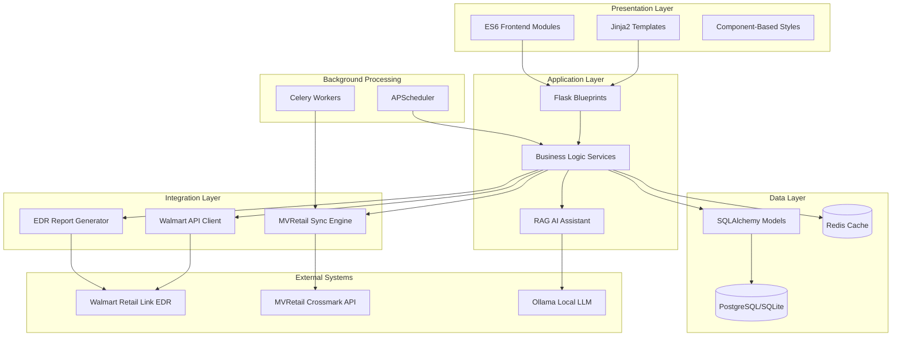
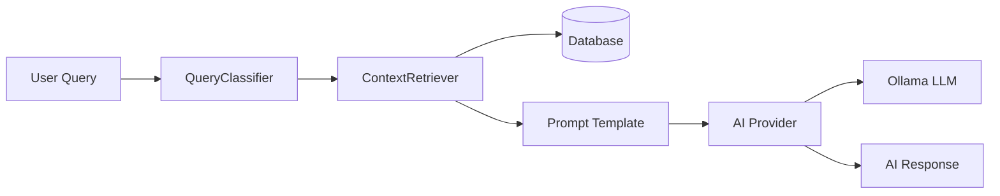
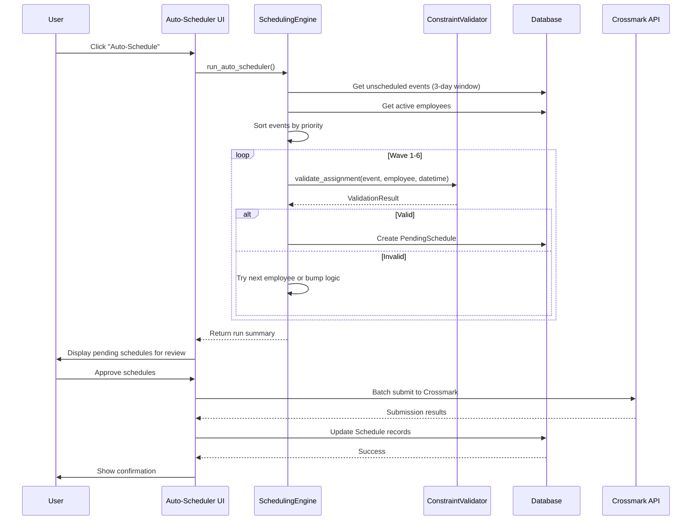
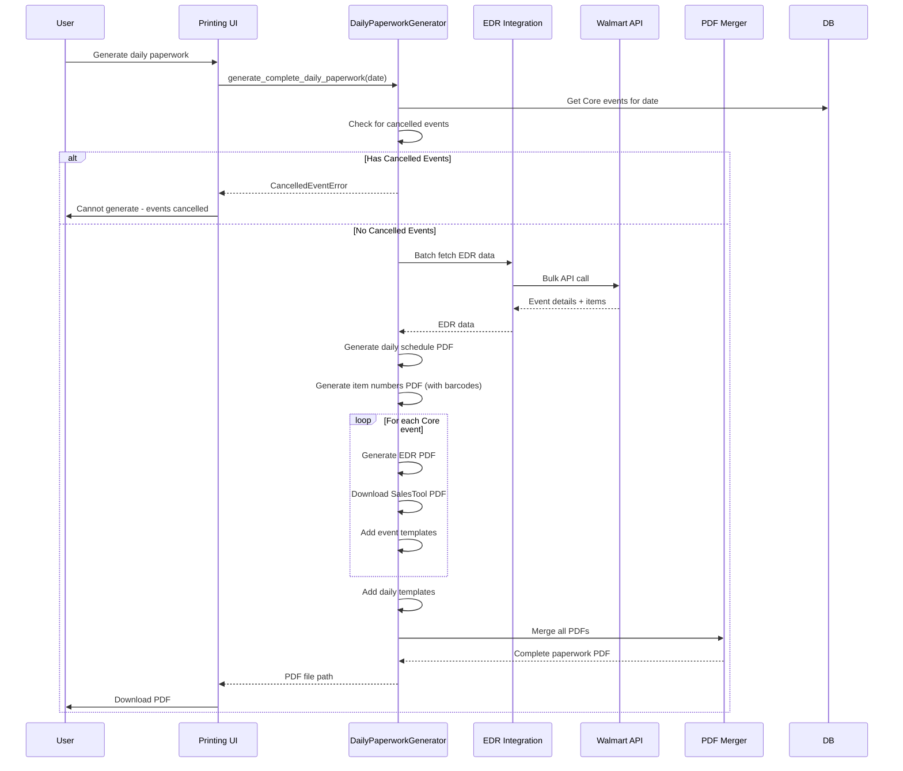

# Codebase Map: Flask Schedule Webapp

> Auto-generated by Cartographer on 2026-01-15

## System Overview

Flask Schedule Webapp is a **production-grade employee scheduling system** for Crossmark that manages event scheduling, employee availability, and integrates with external systems (Walmart Retail Link EDR, MVRetail API). It features an intelligent auto-scheduler with rotation management, AI assistant powered by local LLMs, and comprehensive PDF report generation.

**Tech Stack**: Flask 2.0+, SQLAlchemy, PostgreSQL/SQLite, Celery, Redis, Docker, Ollama AI
**Architecture**: Application Factory Pattern, Model Registry, Blueprint-based routing
**Deployment**: Docker Compose, Cloudflare Tunnel, Nginx, Gunicorn



## Directory Structure

```
flask-schedule-webapp/
├── app/                          # Main application package
│   ├── __init__.py              # Application factory (2,488 tokens)
│   ├── config.py                # Environment configs (2,036 tokens)
│   ├── constants.py             # Event types, dept codes (46,015 tokens)
│   ├── extensions.py            # Flask extensions init
│   │
│   ├── models/                  # SQLAlchemy models (Factory Pattern)
│   │   ├── __init__.py          # Model factory orchestrator
│   │   ├── registry.py          # Centralized model access
│   │   ├── employee.py          # Employee model
│   │   ├── event.py             # Work event/task model
│   │   ├── schedule.py          # Event-employee assignment
│   │   ├── availability.py      # Employee availability patterns
│   │   ├── auto_scheduler.py   # Rotation & pending schedules
│   │   ├── audit.py             # Audit logs & notifications
│   │   ├── inventory.py         # Supply tracking (3,118 tokens)
│   │   └── [15 more models]
│   │
│   ├── routes/                  # Flask blueprints
│   │   ├── main.py              # Dashboard, calendar views (6,206 tokens)
│   │   ├── auth.py              # Authentication, session mgmt (4,456 tokens)
│   │   ├── scheduling.py        # Scheduling operations (6,273 tokens)
│   │   ├── auto_scheduler.py   # Auto-scheduler interface (12,760 tokens)
│   │   ├── api.py               # Main REST API (42,566 tokens)
│   │   ├── employees.py         # Employee CRUD (7,075 tokens)
│   │   ├── dashboard.py         # Validation dashboards (8,129 tokens)
│   │   ├── printing.py          # PDF generation (11,423 tokens)
│   │   └── [12 more blueprints]
│   │
│   ├── services/                # Business logic layer
│   │   ├── scheduling_engine.py      # Auto-scheduler orchestrator (34,624 tokens)
│   │   ├── schedule_verification.py  # Daily validation (17,737 tokens)
│   │   ├── weekly_validation.py      # Cross-day validation (6,627 tokens)
│   │   ├── constraint_validator.py   # Business rules (4,608 tokens)
│   │   ├── rotation_manager.py       # Rotation assignments (1,837 tokens)
│   │   ├── conflict_resolver.py      # Event bumping logic (1,654 tokens)
│   │   ├── daily_paperwork_generator.py  # PDF packaging (8,619 tokens)
│   │   ├── ai_assistant.py           # AI chat orchestration (4,203 tokens)
│   │   ├── ai_tools.py               # LLM function calling (29,595 tokens)
│   │   └── [13 more services]
│   │
│   ├── ai/                      # RAG-based AI assistant
│   │   ├── config.py            # AI configuration
│   │   ├── routes.py            # AI API endpoints (998 tokens)
│   │   ├── context/
│   │   │   ├── classifier.py    # Query type detection (1,565 tokens)
│   │   │   └── retriever.py     # Database context retrieval (2,420 tokens)
│   │   ├── providers/
│   │   │   ├── base.py          # Abstract provider interface
│   │   │   └── ollama.py        # Local LLM integration (1,064 tokens)
│   │   ├── prompts/
│   │   │   └── templates.py     # LLM prompt templates
│   │   └── services/
│   │       └── chat.py          # Chat service (1,269 tokens)
│   │
│   ├── integrations/            # External system clients
│   │   ├── walmart_api/         # Walmart Retail Link
│   │   │   ├── routes.py        # Walmart endpoints (10,328 tokens)
│   │   │   ├── authenticator.py # MFA auth flow (3,249 tokens)
│   │   │   └── session_manager.py # Per-user sessions (1,327 tokens)
│   │   ├── external_api/        # MVRetail Crossmark
│   │   │   ├── session_api_service.py  # API client (11,479 tokens)
│   │   │   └── sync_engine.py   # Bidirectional sync (6,348 tokens)
│   │   └── edr/                 # EDR report generation
│   │       ├── report_generator.py     # EDR data fetching (15,209 tokens)
│   │       ├── pdf_generator.py        # EDR PDF creation (9,953 tokens)
│   │       └── db_manager.py           # SQLite cache (3,331 tokens)
│   │
│   ├── error_handlers/          # Centralized error handling
│   │   ├── exceptions.py        # Custom exception hierarchy
│   │   ├── decorators.py        # Error handling decorators
│   │   └── logging.py           # Structured logging (2,028 tokens)
│   │
│   ├── static/                  # Frontend assets
│   │   ├── js/
│   │   │   ├── utils/           # API client, cache manager
│   │   │   ├── modules/         # State, validation, toasts, ARIA
│   │   │   ├── components/      # Modals, AI chat, conflict validator
│   │   │   ├── pages/           # Page-specific logic (daily view, etc.)
│   │   │   └── [core scripts]   # main.js, employees.js, login.js
│   │   └── css/
│   │       ├── style.css        # Design system + globals (10,493 tokens)
│   │       ├── pages/           # Page-specific styles
│   │       └── components/      # Component styles
│   │
│   ├── templates/               # Jinja2 templates
│   │   ├── base.html            # Master template (5,440 tokens)
│   │   ├── index.html           # Dashboard (21,291 tokens)
│   │   ├── daily_view.html      # Daily schedule view
│   │   ├── auto_scheduler_main.html     # Auto-scheduler UI
│   │   ├── auto_schedule_review.html    # Approval workflow
│   │   ├── dashboard/           # Validation dashboards (4 templates)
│   │   ├── employees/           # Employee management (3 templates)
│   │   ├── help/                # User guides (10 templates)
│   │   └── [30 more templates]
│   │
│   └── utils/                   # Utility functions
│       ├── db_helpers.py        # Query optimizations (1,502 tokens)
│       ├── event_helpers.py     # Event processing (3,687 tokens)
│       ├── encryption.py        # Fernet encryption
│       └── validators.py        # Validation functions
│
├── tests/                       # Pytest test suite
│   ├── conftest.py              # Fixtures (268 tokens)
│   ├── test_models.py           # Model tests (559 tokens)
│   ├── test_routes.py           # Route tests (192 tokens)
│   ├── test_scheduling_engine.py # Engine tests (890 tokens)
│   └── test_validator.py        # Validator tests (927 tokens)
│
├── migrations/                  # Alembic database migrations
│   ├── versions/                # Migration scripts (16 files)
│   └── env.py                   # Alembic environment
│
├── deployment/                  # Deployment configurations
│   ├── docker/
│   │   ├── Dockerfile           # Production image
│   │   ├── Dockerfile.dev       # Development image
│   │   ├── docker-compose.yml   # Multi-service orchestration
│   │   └── docker-compose.dev.yml
│   ├── nginx/
│   │   ├── nginx.conf           # Main Nginx config
│   │   └── app.conf             # Proxy configuration
│   ├── systemd/
│   │   └── scheduler.service    # Systemd unit file
│   └── CLOUDFLARE_TUNNEL_SETUP.md
│
├── scripts/                     # Utility scripts
│   ├── backup_database.py       # Automated backups (2,284 tokens)
│   └── restore_database.py      # Backup restoration (2,227 tokens)
│
├── docs/                        # Documentation
│   └── scheduling_validation_rules.md
│
├── wsgi.py                      # Application entry point (283 tokens)
├── gunicorn_config.py           # WSGI server config (885 tokens)
├── celery_worker.py             # Background task worker (77 tokens)
├── requirements.txt             # Python dependencies (556 tokens)
├── pytest.ini                   # Test configuration
├── CLAUDE.md                    # AI assistant instructions (959 tokens)
└── AGENTS.md                    # Agent-specific guidance
```

## Core Module Guide

### Application Foundation

**Purpose**: Flask application initialization with factory pattern

**Entry Point**: `app/__init__.py:create_app()`

**Key Files**:
| File | Purpose | Tokens |
|------|---------|--------|
| `app/__init__.py` | App factory, blueprint registration, extensions | 2,488 |
| `app/config.py` | Environment-based configuration | 2,036 |
| `app/extensions.py` | Flask extension initialization | 167 |
| `app/constants.py` | Event types, department codes, time slots | 46,015 |

**Key Features**:
- Application factory pattern for different environments (dev/test/prod)
- Model registry pattern for dependency injection
- Blueprint-based modular architecture
- APScheduler for background tasks
- ProxyFix middleware for Cloudflare Tunnel

**Configuration Structure**:
```python
DevelopmentConfig:  SQLite, random SECRET_KEY, debug=True
TestingConfig:      In-memory SQLite, SYNC_ENABLED=False
ProductionConfig:   PostgreSQL, strong SECRET_KEY (required), validation enabled
```

---

### Models (Database Layer)

**Purpose**: SQLAlchemy models with factory pattern for dependency injection

**Architecture**: Factory functions returning model classes

**Entry Point**: `app/models/__init__.py:init_models(db)`

**Core Models**:
| Model | File | Purpose | Key Fields |
|-------|------|---------|------------|
| Employee | employee.py | Staff/representatives | id, name, job_title, is_active, termination_date |
| Event | event.py | Work tasks/visits | project_ref_num, start/due_datetime, event_type, location |
| Schedule | schedule.py | Event-employee assignments | event_ref_num, employee_id, schedule_datetime, shift_block |
| EmployeeAvailability | availability.py | Date-specific availability | employee_id, date, is_available |
| EmployeeWeeklyAvailability | availability.py | Recurring weekly pattern | monday-sunday booleans |
| EmployeeTimeOff | availability.py | Time-off requests | start_date, end_date |
| RotationAssignment | auto_scheduler.py | Weekly rotations | day_of_week, rotation_type, employee_id |
| PendingSchedule | auto_scheduler.py | Auto-scheduler proposals | scheduler_run_id, status, swap tracking |

**Model Registry Pattern**:
```python
# Old (deprecated)
Employee = current_app.config['Employee']

# New (recommended)
from app.models import get_models
models = get_models()
Employee = models['Employee']
```

**Business Logic Examples**:
- `Employee.can_work_event_type()` - Role-based event restrictions
- `Event.detect_event_type()` - Auto-classify from project_name
- `CompanyHoliday.is_holiday()` - Check if date is holiday

---

### Services (Business Logic)

**Purpose**: Core scheduling algorithms and business rules

**Key Services**:

#### SchedulingEngine (34,624 tokens)
**File**: `app/services/scheduling_engine.py`

**Purpose**: Auto-scheduler orchestrator with 6-wave priority algorithm

**Algorithm**:
```
Wave 1: Rotation Events (Juicer, Digital) → Rotation employees
Wave 2: Core Events (Primary Lead priority) → Block 1 assignment
Wave 3: Core Events (Remaining) → Cascading bump logic
Wave 4: Supervisor Events → Auto-pair with Core events
Wave 5: Freeosk/Digital Events → Available time slots
Wave 6: Other Event Types → Catch-all
Rescue: Urgent Events (due within 3 days)
```

**Key Methods**:
- `run_auto_scheduler()` - Main entry point
- `_schedule_rotation_events()` - Wave 1: Juicer/Digital
- `_schedule_core_events()` - Wave 2-3: Core assignments
- `_pair_supervisor_events()` - Wave 4: Auto-pairing
- `_try_bump_for_day()` - Conflict resolution via event bumping

**Dependencies**: RotationManager, ConstraintValidator, ShiftBlockConfig

---

#### ConstraintValidator (4,608 tokens)
**File**: `app/services/constraint_validator.py`

**Purpose**: Validates scheduling assignments against business rules

**Constraints Checked**:
1. Company holidays - No work on holidays
2. Time-off requests - Employee unavailability
3. Weekly availability - Recurring patterns
4. Role requirements - Lead-only event types
5. Daily limit - Max 1 Core event per day
6. Weekly limit - Max 6 Core events per week
7. Already scheduled - Overlap detection
8. Due date - Must schedule before due

**Key Methods**:
- `validate_assignment()` - Main validation
- `get_available_employees()` - Filter by constraints
- `_check_daily_limit()`, `_check_weekly_limit()` - Core limits

**Business Rules**:
```python
LEAD_ONLY_EVENT_TYPES = ['Freeosk', 'Digitals', 'Digital Setup', 'Digital Refresh', 'Digital Teardown']
MAX_CORE_EVENTS_PER_DAY = 1
MAX_CORE_EVENTS_PER_WEEK = 6  # Sunday-Saturday
```

---

#### Schedule Verification Services

**Daily Validation** (`schedule_verification.py` - 17,737 tokens):
- Validates single day against ~20 business rules
- Returns structured issue reports with severity levels
- Critical/Warning/Info categorization

**Weekly Validation** (`weekly_validation.py` - 6,627 tokens):
- Validates 7-day schedules
- Cross-day rules (max events per week, randomization)
- Health score calculation (0-100)

**Daily Audit** (`daily_audit_checker.py` - 5,290 tokens):
- Proactive issue detection
- Rotation gap checking
- Urgent unscheduled events
- Scan-out deadline warnings

---

#### AI Assistant (4,203 tokens)
**File**: `app/services/ai_assistant.py`

**Purpose**: Natural language interface to scheduling data

**Architecture**: RAG (Retrieval-Augmented Generation)

**Flow**:
```
User Query → QueryClassifier → ContextRetriever → LLM Prompt → Provider → Response
```

**Query Types**: Availability, Schedule View, Conflict Check, Employee Suggest, Workload Analysis

**Providers**: Ollama (local), OpenAI, Anthropic, Google Gemini

---

### Routes (Flask Blueprints)

**Purpose**: HTTP endpoint handlers organized by feature

**Blueprint Architecture**:

| Blueprint | Prefix | File | Purpose | Tokens |
|-----------|--------|------|---------|--------|
| `main_bp` | `/` | main.py | Dashboard, calendar, daily view | 6,206 |
| `auth_bp` | `/` | auth.py | Login, session, MFA | 4,456 |
| `scheduling_bp` | `/` | scheduling.py | Schedule CRUD operations | 6,273 |
| `auto_scheduler_bp` | `/auto-schedule` | auto_scheduler.py | Auto-scheduler UI | 12,760 |
| `api_bp` | `/api` | api.py | Main REST API | 42,566 |
| `employees_bp` | `/` | employees.py | Employee management | 7,075 |
| `dashboard_bp` | `/dashboard` | dashboard.py | Validation dashboards | 8,129 |
| `printing_bp` | `/printing` | printing.py | PDF generation | 11,423 |
| `walmart_bp` | `/api/walmart` | walmart_api/routes.py | Walmart integration | 10,328 |
| `ai_bp` | `/api/ai` | ai/routes.py | AI assistant API | 998 |

**Common Patterns**:
- `@require_authentication()` decorator for protected routes
- CSRF protection on all POST/PUT/DELETE
- JSON responses for API endpoints
- HTML templates for user-facing pages
- Rate limiting on sensitive endpoints (login: 5/min)

---

### Integrations

#### Walmart Retail Link API
**Location**: `app/integrations/walmart_api/`

**Purpose**: Fetch Event Detail Reports (EDR), roll events, get approved events

**Authentication**: 6-step MFA flow with SMS OTP
```
1. Submit password → 2. Request MFA code (SMS) → 3. Validate code
→ 4. Register page access → 5. Navigate to Event Mgmt → 6. Get auth token
```

**Session Management**: Per-user sessions with 10-minute timeout

**Key Operations**:
- `get_edr_report(event_id)` - Fetch EDR data (items, instructions)
- `get_approved_events()` - APPROVED status events (LIA)
- `roll_event()` - Reschedule event to new date
- `batch_download_edrs()` - Multi-event PDF generation

**Gotcha**: MFA credential ID must be extracted from browser DevTools

---

#### MVRetail (Crossmark) API
**Location**: `app/integrations/external_api/`

**Purpose**: Bidirectional sync with Crossmark scheduling system

**Authentication**: PHPSESSID cookie-based session

**Sync Operations**:
- **External → Local**: Fetch events, merge into database
- **Local → External**: Submit schedules, handle updates/deletes

**Key Services**:
- `SessionAPIService` - API client with auto-refresh
- `SyncEngine` - Bidirectional synchronization
- Celery tasks for async operations

**Conflict Resolution**: Delete-then-create strategy (no direct updates)

---

#### EDR Report Generation
**Location**: `app/integrations/edr/`

**Purpose**: Generate formatted PDFs for printing with offline caching

**Components**:
- `EDRReportGenerator` - Fetch EDR data with bulk API
- `EDRPDFGenerator` - Create formatted PDF reports
- `EDRDBManager` - SQLite cache for offline access

**Cache Strategy**:
- 24-hour freshness window
- Bulk API call for multiple events
- Single auth → 50+ reports without re-auth

**PDF Contents**: Event header, items table with barcodes, shift times, signature section

---

### AI Module

**Location**: `app/ai/`

**Purpose**: RAG-based scheduling assistant with local LLM

**Architecture**:



**Components**:
| Component | File | Purpose |
|-----------|------|---------|
| QueryClassifier | context/classifier.py | Determine query intent |
| ContextRetriever | context/retriever.py | Fetch relevant DB records |
| PromptTemplates | prompts/templates.py | LLM prompt engineering |
| OllamaProvider | providers/ollama.py | Local LLM integration |
| ChatService | services/chat.py | Orchestration layer |

**Supported Queries**:
- "Who's available tomorrow?"
- "Show me this week's schedule"
- "Any conflicts on Friday?"
- "Who should I assign to this Core event?"
- "What's the workload distribution?"

**AI Providers**:
- **Ollama** (default): Local LLM, zero cost, privacy-first
- **Google Gemini**: $0.075/1M tokens (cheapest cloud)
- **OpenAI**: $0.15/1M tokens
- **Anthropic**: $0.25/1M tokens

**Models**:
- `llama3.2:3b` - Balanced (default)
- `ministral-3:3b` - Fast, efficient
- `deepseek-r1:8b` - Reasoning-focused

---

### Frontend Architecture

**Location**: `app/static/` and `app/templates/`

**Architecture**: Hybrid server-rendered + ES6 modules

**JavaScript Modules**:

| Category | Files | Purpose |
|----------|-------|---------|
| **Utils** | api-client.js, cache-manager.js, debounce.js | HTTP client, caching, performance |
| **Modules** | state-manager.js, validation-engine.js, toast-notifications.js, aria-announcer.js, focus-trap.js | Core infrastructure |
| **Components** | modal.js, schedule-modal.js, reschedule-modal.js, ai-chat.js | Reusable UI components |
| **Pages** | daily-view.js (127KB), dashboard.js, attendance-calendar.js | Page-specific logic |

**Key Features**:
- **State Management**: localStorage/sessionStorage with namespace isolation
- **API Client**: CSRF protection, timeout handling, automatic retry
- **Validation**: Async validation engine with real-time conflict detection
- **Accessibility**: ARIA live regions, focus trap, keyboard navigation
- **Notifications**: Toast system with auto-dismiss and queue management

**CSS Architecture**:
- Design system with CSS variables
- Component-based organization
- Responsive breakpoints (mobile, tablet, desktop)
- Brand colors: Navy (#2E4C73), Blue (#1B9BD8)

**Templates**:
- Base template with master layout (5,440 tokens)
- 43 total templates (pages, components, dashboards)
- Jinja2 inheritance pattern

---

## Data Flow

### Auto-Scheduler Workflow



### Daily Paperwork Generation



---

## Event Types & Scheduling Priority

### Event Types

| Event Type | Default Duration | Scheduling Priority | Special Rules |
|------------|------------------|---------------------|---------------|
| Juicer Production | 540 min (9h) | 1 (Highest) | Rotation employee only |
| Digital Setup | 30 min | 2 | Rotation employee priority |
| Digital Refresh | 15 min | 3 | Rotation employee priority |
| Freeosk | 15 min | 4 | Lead Event Specialist or Club Supervisor |
| Digital Teardown | 15 min | 5 | Lead or Club Supervisor |
| Core | 390 min (6.5h) | 6 | Max 1/day, max 6/week per employee |
| Supervisor | 5 min | 7 | Auto-paired with Core events |
| Digitals | 15 min | 8 | Lead or Club Supervisor |
| Other | 15 min | 9 (Lowest) | Any active employee |

### Scheduling Priority Algorithm

**3-Day Window**: Events scheduled 3 days before `start_datetime`

**Priority Order**: Juicer > Digital Setup > Digital Refresh > Freeosk > Digital Teardown > Core > Supervisor > Digitals > Other

**Wave System**:
1. **Wave 1**: Rotation-based events (Juicer, Digital) assigned to rotation employees
2. **Wave 2**: Core events - Primary Lead gets Block 1
3. **Wave 3**: Remaining Core events with cascading bump logic
4. **Wave 4**: Supervisor events auto-paired with Core (same event number)
5. **Wave 5**: Freeosk & Digital events to available slots
6. **Wave 6**: Other event types
7. **Rescue**: Events due within 3 days (final attempt)

### Business Rules

**Hard Constraints** (cannot violate):
- ✓ Company holidays (no work)
- ✓ Employee time-off
- ✓ Weekly availability pattern
- ✓ Role requirements (job title)
- ✓ Max 1 Core event per employee per day
- ✓ Max 6 Core events per employee per week
- ✓ Already scheduled conflicts (no double-booking)
- ✓ Event within date range

**Soft Constraints** (warnings):
- ⚠ Club Supervisor on regular events
- ⚠ Time proximity (events within 2 hours)

---

## Validation Rules

### Daily Validation (20+ Rules)

**File**: `app/services/schedule_verification.py`

| Rule | Type | Description |
|------|------|-------------|
| RULE-001 | Critical | Time off conflicts |
| RULE-002 | Critical | Double booking detection |
| RULE-003 | Warning | Primary Lead must have Block 1 |
| RULE-004 | Critical | Max 1 Core event per day per employee |
| RULE-005 | Critical | Employee must be active |
| RULE-006 | Warning | Club Supervisor on Core event |
| RULE-007 | Critical | Same time slot conflicts |
| ... | ... | ... (13 more rules) |

### Weekly Validation (Additional Rules)

**File**: `app/services/weekly_validation.py`

| Rule | Type | Description |
|------|------|-------------|
| RULE-017 | Warning | Schedule randomization (not same time 4+ days) |
| RULE-018 | Critical | Max 6 Core events per week per employee |
| RULE-019 | Critical | Max 5 Juicer Production events per week |
| RULE-020 | Warning | No duplicate products same day |
| RULE-021 | Warning | Time slot distribution (2-2-2-2 pattern) |
| RULE-022 | Warning | Club Supervisors on Core events |
| RULE-023 | Warning | Club Supervisors on Digital when Leads available |

### Health Score Calculation

```
Health Score = 100 - (critical_count × 10) - (warning_count × 3)
Range: 0-100
90-100: Excellent
70-89: Good
50-69: Fair
Below 50: Needs attention
```

---

## Deployment Architecture

### Docker Compose Stack

```
┌─────────────────────────────────────────────────────────┐
│                    Internet (HTTPS)                      │
└────────────────────┬────────────────────────────────────┘
                     │
                     ▼
┌─────────────────────────────────────────────────────────┐
│              Cloudflare Tunnel                           │
│  • Zero-trust access                                     │
│  • DDoS protection                                       │
│  • SSL/TLS termination                                   │
└────────────────────┬────────────────────────────────────┘
                     │
                     ▼
┌─────────────────────────────────────────────────────────┐
│         Nginx Reverse Proxy (Container)                  │
│  • Static file serving (1 year cache)                    │
│  • Proxy to Gunicorn                                     │
│  • Security headers                                      │
└────────────────────┬────────────────────────────────────┘
                     │
                     ▼
┌─────────────────────────────────────────────────────────┐
│      Gunicorn WSGI Server (Container)                    │
│  • 1 worker (gevent async)                               │
│  • Timeout: 120s (long requests)                         │
│  • Max requests: 10000 (worker recycling)                │
└────────────────────┬────────────────────────────────────┘
                     │
      ┌──────────────┴──────────────┐
      │                             │
      ▼                             ▼
┌────────────┐              ┌────────────┐
│ PostgreSQL │              │   Redis    │
│ Container  │              │ Container  │
│            │              │            │
│ • 15-alpine│              │ • 7-alpine │
│ • Volumes  │              │ • AOF      │
└────────────┘              └────────────┘
      │
      │ Used by
      ▼
┌────────────┐
│   Celery   │
│   Worker   │
│ Container  │
└────────────┘
```

**Services**:
- **db**: PostgreSQL 15 (production) or SQLite (dev)
- **redis**: Redis 7 for task queue and caching
- **app**: Flask application with Gunicorn
- **celery**: Background task processor
- **nginx**: Reverse proxy (production profile only)

**Critical Configuration**:
- Single Gunicorn worker (EDR MFA session state)
- Gevent async I/O for concurrency
- Cloudflare Tunnel for residential network bypass

---

## Navigation Guide

### To Add a New Auto-Scheduler Rule

1. **Define validation logic**: `app/services/constraint_validator.py`
   - Add `_check_new_rule()` method
   - Update `validate_assignment()` to call it

2. **Update SchedulingEngine**: `app/services/scheduling_engine.py`
   - Modify wave logic if needed
   - Add exception handling

3. **Add tests**: `tests/test_validator.py`
   - Unit test for new rule
   - Integration test with scheduler

### To Add a New Event Type

1. **Update constants**: `app/constants.py`
   - Add to `EVENT_TYPES` list
   - Set default duration in `EVENT_DURATIONS`
   - Add to priority order in `EVENT_PRIORITY`

2. **Update Event model**: `app/models/event.py`
   - Extend `detect_event_type()` pattern matching

3. **Update time settings**: `app/services/event_time_settings.py`
   - Define allowed time slots

4. **Update scheduling engine**: `app/services/scheduling_engine.py`
   - Add wave logic if special handling needed

### To Add a New API Endpoint

1. **Choose blueprint**: `app/routes/` (or create new)
   - `api.py` for general API
   - `api_*.py` for specialized endpoints

2. **Create endpoint**:
   ```python
   @api_bp.route('/api/new-endpoint', methods=['POST'])
   @require_authentication()  # If needed
   @handle_errors  # Error handling
   def new_endpoint():
       # Business logic
       return jsonify({'success': True, 'data': result})
   ```

3. **Add CSRF exemption** (if needed): `app/__init__.py`

4. **Update frontend**: `app/static/js/utils/api-client.js`
   - Use `apiClient.post('/api/new-endpoint', data)`

### To Add a New Validation Rule

1. **Daily validation**: `app/services/schedule_verification.py`
   - Add to `verify_schedule()` method
   - Return `VerificationIssue` objects

2. **Weekly validation**: `app/services/weekly_validation.py`
   - Add cross-day logic if needed
   - Update health score calculation

3. **Add to documentation**: `docs/scheduling_validation_rules.md`

### To Modify PDF Reports

1. **Daily paperwork**: `app/services/daily_paperwork_generator.py`
   - Update `generate_complete_daily_paperwork()`

2. **EDR PDFs**: `app/integrations/edr/pdf_generator.py`
   - Modify `generate_pdf()` layout

3. **Templates**: Add new paperwork templates via admin UI
   - Stored in `PaperworkTemplate` model

---

## Conventions

### Naming Conventions

**Models**: PascalCase singular (`Employee`, `Event`, `Schedule`)

**Files**: snake_case (`scheduling_engine.py`, `api_notes.py`)

**Functions**: snake_case (`run_auto_scheduler()`, `validate_assignment()`)

**Constants**: UPPER_SNAKE_CASE (`MAX_CORE_EVENTS_PER_DAY`)

**Blueprints**: snake_case with `_bp` suffix (`auto_scheduler_bp`)

### Code Organization

**Model Factory Pattern**:
```python
# app/models/example.py
def create_example_model(db):
    class Example(db.Model):
        # ...
    return Example
```

**Service Pattern**:
```python
# app/services/example_service.py
class ExampleService:
    def __init__(self, db, models):
        self.db = db
        self.models = models

    def perform_action(self):
        # Business logic
```

**API Response Format**:
```python
# Success
{'success': True, 'data': {...}, 'message': 'Optional'}

# Error
{'success': False, 'error': 'Error message', 'details': {...}}
```

### Database Patterns

**Query Optimization**:
- Use `joinedload()` for eager loading (prevent N+1)
- Date ranges: datetime comparisons (not `func.date()`)
- Bulk operations: `bulk_insert_mappings()`

**Migrations**:
- Descriptive names: `add_shift_block_columns_to_schedules`
- Always test upgrade AND downgrade

---

## Gotchas

### Critical Issues

1. **Single Gunicorn Worker Required**
   - Walmart EDR MFA uses global session state
   - Multiple workers lose session between MFA steps
   - Solution: `workers = 1` in gunicorn_config.py

2. **Supervisor Event Pairing**
   - Supervisor events must match Core event 6-digit number
   - Auto-pairing uses regex `\d{6}` extraction
   - Date windows must overlap for pairing

3. **Shift Block Assignment**
   - First 8 events: Sequential [1,2,3,4,5,6,7,8]
   - Overflow (9+): Priority [1,3,5,7,2,4,6,8]
   - Primary Lead always gets Block 1

4. **EDR Cache Limitations**
   - Bulk API doesn't return `demoInstructions`
   - Cached reports show "N/A" for instructions
   - Use direct API for full data

5. **MVRetail external_id Format**
   - Correct: "44212583" (scheduleEventID)
   - Wrong: "31785775_157384" (old format)
   - Cleanup logic strips incorrect format

### Configuration Gotchas

1. **SECRET_KEY in Production**
   - Must be 32+ characters
   - Random generation in dev (non-persistent)
   - Validate via `config.validate()`

2. **Timezone Handling**
   - MVRetail requires ISO8601 with colon: `2026-01-04T10:30:00-05:00`
   - Must URL-encode datetime in form data

3. **CSRF Token Sources**
   - Priority: Cookie → Meta tag → Global function
   - Automatic injection via csrf_helper.js

4. **Database Path**
   - SQLite paths converted to absolute
   - Relative paths fail in production

### Performance Gotchas

1. **Daily View Size**
   - daily-view.js is 127KB
   - Consider code splitting

2. **Polling vs WebSocket**
   - Session status polled every 30s
   - Could use SSE/WebSocket

3. **N+1 Queries**
   - Use `get_schedules_with_relations()` helper
   - Eager load with `joinedload()`

---

## Testing Strategy

### Test Organization

```
tests/
├── conftest.py           # Pytest fixtures (app, db, client)
├── test_models.py        # Model logic tests
├── test_routes.py        # Endpoint tests
├── test_scheduling_engine.py  # Auto-scheduler tests
└── test_validator.py     # Validation tests
```

**Test Coverage**: ~327 lines of tests

**Running Tests**:
```bash
pytest                    # All tests
pytest -v                 # Verbose
pytest --cov=app          # With coverage
pytest tests/test_models.py::test_name  # Specific test
```

**Test Environment**:
- Isolated SQLite database: `instance/scheduler_test.db`
- Disabled external integrations
- Port 8002 for test instance

---

## External Dependencies

### Python Packages (requirements.txt)

**Core Framework**:
- Flask 2.0+
- SQLAlchemy 1.4+
- Flask-Migrate (Alembic)
- Flask-WTF (CSRF)
- Flask-Limiter (rate limiting)

**AI & ML**:
- ollama 0.4.0+ (local LLM)
- google-generativeai 0.3.0+ (cloud option)

**HTTP & Async**:
- requests 2.28+
- gevent 24.2+ (async workers)
- celery 5.3+ (background tasks)

**PDF Generation**:
- reportlab 3.6+
- xhtml2pdf 0.2.13+
- PyPDF2 3.0+
- python-barcode 0.14+ (optional)

**Database**:
- psycopg2-binary 2.9+ (PostgreSQL)
- redis 5.0+

**Utilities**:
- python-decouple 3.8+ (config)
- cryptography 41.0+ (encryption)
- python-dateutil 2.8+

### External Systems

| System | Purpose | Required |
|--------|---------|----------|
| Walmart Retail Link | EDR reports, event rolling | Optional |
| MVRetail API | Event/employee sync | Optional (SYNC_ENABLED) |
| Ollama | Local AI assistant | Optional (AI_ENABLED) |
| PostgreSQL | Production database | Production only |
| Redis | Task queue, caching | Production only |
| Cloudflare Tunnel | Remote access | Deployment only |

---

## Cost Analysis

### Infrastructure Costs

**Monthly Operating Costs** (estimated):
- Server: Variable (self-hosted, residential electricity)
- Cloudflare Tunnel: **$0** (free tier)
- AI (Ollama local): **$0** (no API costs)
- PostgreSQL: **$0** (self-hosted container)
- Redis: **$0** (self-hosted container)
- Domain: ~$12/year (**$1/month**)

**Total: ~$1/month** (domain registration only)

### AI Cost Comparison

**50 queries/day, 30 days/month**:
- Ollama (local): **$0/month**
- Google Gemini: **$0.11/month** ($0.075/1M tokens)
- OpenAI GPT-4o-mini: **$0.23/month** ($0.15/1M tokens)
- Anthropic Claude Haiku: **$0.38/month** ($0.25/1M tokens)

---

## Future Enhancement Opportunities

### Architecture
- [ ] Multi-worker support with Redis session store (for EDR)
- [ ] WebSocket/SSE for real-time updates (replace polling)
- [ ] Code splitting for large frontend modules (daily-view.js)
- [ ] Service worker for offline support

### Features
- [ ] Email notifications (Celery tasks)
- [ ] SMS notifications for urgent schedules
- [ ] Employee mobile app
- [ ] Advanced analytics dashboard
- [ ] Predictive scheduling (ML-based)

### Testing
- [ ] Comprehensive unit test coverage (target: 80%+)
- [ ] Integration tests for external APIs
- [ ] E2E tests with Playwright/Cypress
- [ ] Accessibility testing (Axe/Pa11y)

### Performance
- [ ] CDN for static assets
- [ ] Database read replicas
- [ ] Caching layer optimization
- [ ] Background cache warming

### Security
- [ ] Two-factor authentication for users
- [ ] Audit log retention policy
- [ ] Automated security scanning
- [ ] Secrets management with Vault

---

## Support

For questions or issues:
- **Documentation**: See `/help` routes in application
- **Code Review**: GitHub Actions with Claude Code Review
- **Project Instructions**: `CLAUDE.md` (AI assistant guidance)
- **Agent Instructions**: `AGENTS.md` (agent-specific guidance)

---

**Last Updated**: 2026-01-15
**Generated By**: Cartographer (Claude Code)
**Codebase Size**: 286 files, 992,653 tokens
**Architecture**: Production-grade Flask application with AI integration

If cartographer helped you, consider starring: https://github.com/kingbootoshi/cartographer - please!
