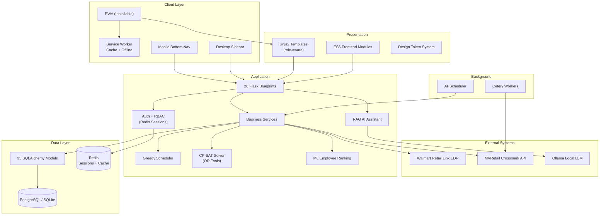
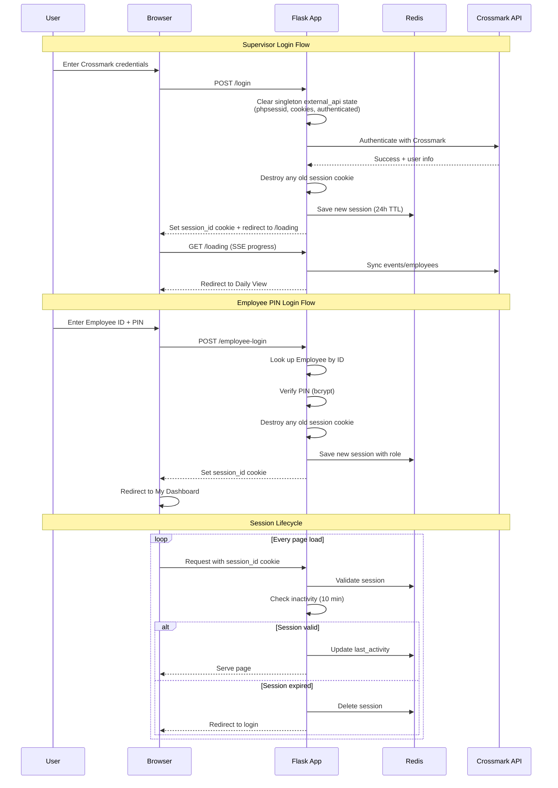
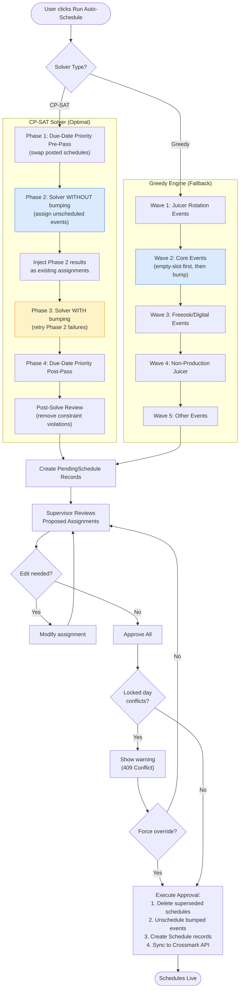
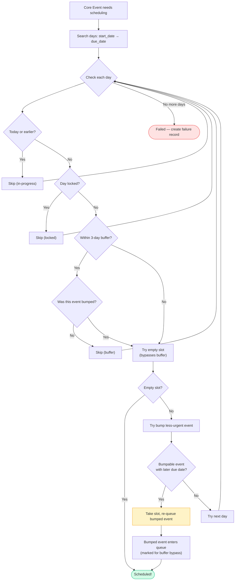
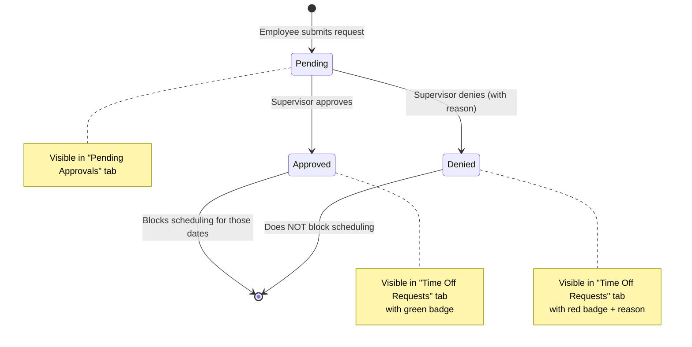
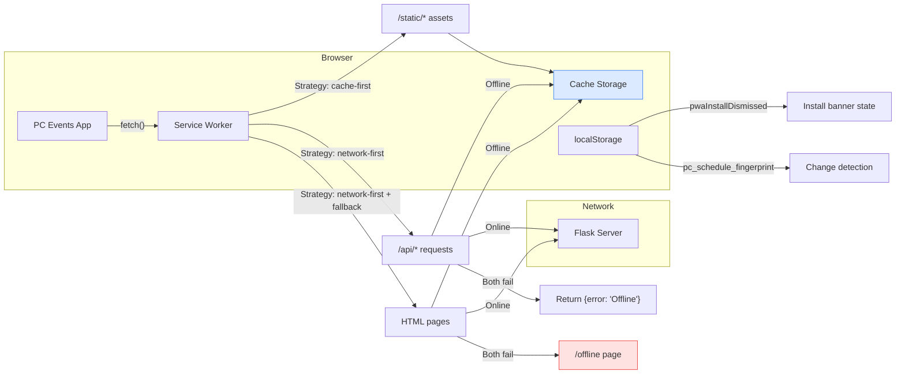
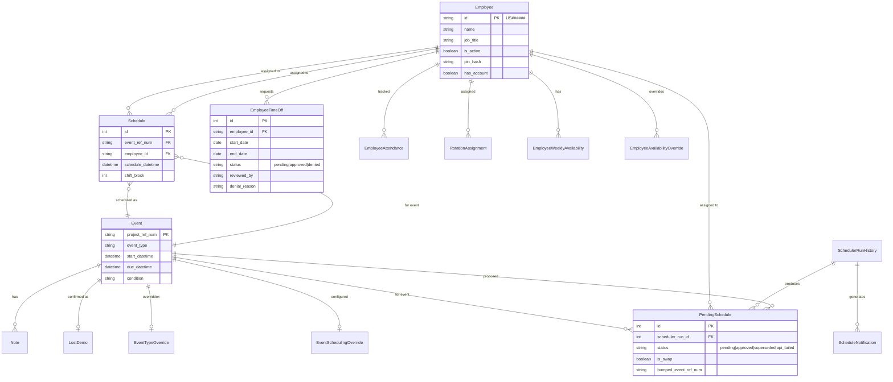
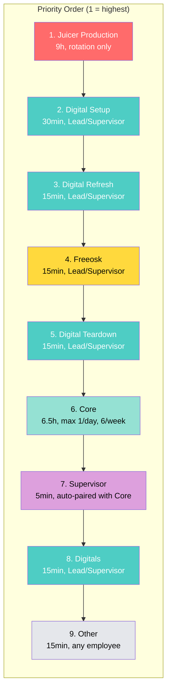
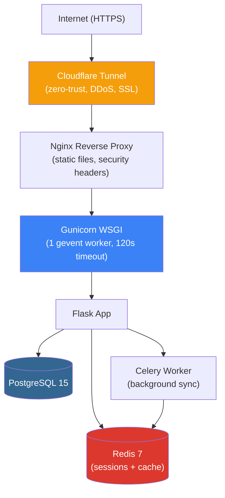

# Architecture Diagrams

> Updated: March 21, 2026

Mermaid diagrams documenting the system architecture, data flows, and key workflows.

---

## 1. System Architecture

---

## 2. Role-Based Access Hierarchy

```mermaid
graph TB
    subgraph "Authentication"
        CL["Crossmark Login<br/>(Username + Password)"]
        PL["PIN Login<br/>(Employee ID + PIN)"]
    end

    subgraph "Roles"
        SUP["Supervisor<br/>Full Access"]
        LEAD["Lead<br/>Team View + Personal"]
        SPEC["Specialist<br/>Personal Only"]
    end

    subgraph "Supervisor Pages"
        CMD["Command Center"]
        DV["Daily View"]
        CAL["Calendar"]
        AUTO["Auto-Scheduler"]
        EMP["Employee Management"]
        ATT_S["Attendance (edit)"]
        AVAIL["Availability Management"]
        REPORTS["Reports (7 types)"]
        PRINT["Printing / PDFs"]
        VALID["Weekly Validation"]
        ADMIN["Settings / Admin"]
        INV["Demo Supplies"]
        LOST["Lost Demos"]
    end

    subgraph "Lead Pages"
        TEAM_DV["Team Daily View<br/>(read-only schedule)"]
        LEAD_ATT["Lead Attendance<br/>(record only)"]
        TEAM_TO["Team Time Off<br/>(view approved)"]
    end

    subgraph "Shared Pages (Specialist + Lead)"
        DASH["My Dashboard"]
        EVENTS["My Events"]
        MONTHLY["Monthly Schedule"]
        TIMEOFF["My Time Off<br/>(submit requests)"]
    end

    CL --> SUP
    PL --> LEAD
    PL --> SPEC

    SUP --> CMD & DV & CAL & AUTO & EMP & ATT_S & AVAIL & REPORTS & PRINT & VALID & ADMIN & INV & LOST
    SUP --> TEAM_DV

    LEAD --> DASH & EVENTS & MONTHLY & TIMEOFF
    LEAD --> TEAM_DV & LEAD_ATT & TEAM_TO

    SPEC --> DASH & EVENTS & MONTHLY & TIMEOFF

    style SUP fill:#0ea5e9,color:#fff
    style LEAD fill:#8b5cf6,color:#fff
    style SPEC fill:#22c55e,color:#fff
```

---

## 3. Authentication Flow

---

## 4. Auto-Scheduler Pipeline

---

## 5. Bump Logic Detail

---

## 6. Time-Off Approval Workflow

Note: Supervisor-created time-off entries (via the Availability page) default directly to `approved` status — they skip the pending step.

---

## 7. PWA & Offline Architecture

### Caching Strategies

| Pattern | Used For | Behavior |
|---------|----------|----------|
| **Cache-first** | `/static/*` (CSS, JS, images) | Serve from cache immediately, fetch in background |
| **Network-first** | `/api/*` (data requests) | Try network, cache response, serve stale on failure |
| **Network-first + fallback** | HTML pages | Try network, then cache, then `/offline` page |

---

## 8. Database Model Relationships

---

## 9. Event Priority & Scheduling Order

---

## 10. Deployment Architecture

> **Critical**: Single Gunicorn worker is required — Walmart EDR MFA uses global session state that doesn't work with multiple workers.
