# CP-SAT Auto-Scheduler Workflow

```mermaid
flowchart TD
    START([run_auto_scheduler]) --> REFRESH[Database Refresh]
    REFRESH --> CREATE_RUN[Create SchedulerRunHistory]

    CREATE_RUN --> P1_START

    subgraph P1["Phase 1: Due-Date Priority Pre-Pass"]
        P1_START[Load posted + unscheduled events] --> P1_SWAP{Unscheduled due date\nearlier than posted?}
        P1_SWAP -->|Yes| P1_DO[Swap into posted slot\nKeep employee/date/time]
        P1_SWAP -->|No| P1_SKIP[Skip]
        P1_DO --> P1_END[Continue to next pair]
        P1_SKIP --> P1_END
    end

    P1_END --> LOAD_START

    subgraph LOAD["Data Loading — _load_data"]
        LOAD_START[Load active employees] --> LOAD_EVT[Load unscheduled events\nApply overrides\nSeparate Supervisors]
        LOAD_EVT --> LOAD_BUMP[Load bumpable events\nif bumping enabled]
        LOAD_BUMP --> LOAD_DAYS[Compute valid days\nExclude holidays + locked days]
        LOAD_DAYS --> LOAD_CONTEXT[Precompute availability\nRotations, existing schedules\nWeek boundaries, Core counts\nPairings, eligibility, product groups]
    end

    LOAD_CONTEXT --> P2_EXCL

    subgraph P2["Phase 2: Solver WITHOUT Bumping"]
        P2_EXCL[Exclude Phase 1 events\nallow_bumping = False] --> P2_VARS
        P2_VARS["Create decision variables\nv_assign_day · v_assign_emp\nv_assign_block · v_scheduled"] --> P2_HARD
        P2_HARD["Add hard constraints H2-H27\n1 day/emp/block per event\nAvailability, daily+weekly limits\nMutual exclusions, pairings\nRotation, block uniqueness"] --> P2_SOFT
        P2_SOFT["Add objective S1-S17\nMaximize scheduled, urgency\nType priority, rotation bonus\nFairness, ML affinity\nEarly scheduling, balance"] --> P2_SOLVE
        P2_SOLVE[Run CP-SAT Solver] --> P2_STATUS{Status?}
        P2_STATUS -->|Optimal/Feasible| P2_EXTRACT["Extract solution\nPass 1: Bumpable events\nPass 2: New events\nCreate PendingSchedules\nPair Supervisors"]
        P2_STATUS -->|Failed| P2_FAIL[Mark all as failed]
        P2_EXTRACT --> P2_POST["Post-solve review\nRemove Core duplicates\nFix cross-run conflicts\nEnforce weekly limits"]
    end

    P2_POST --> P3_CHECK
    P2_FAIL --> P3_CHECK
    P3_CHECK{Phase 2 failures?}
    P3_CHECK -->|No| P4_START
    P3_CHECK -->|Yes| P3_COLLECT

    subgraph P3["Phase 3: Solver WITH Bumping"]
        P3_COLLECT[Collect failed event refs] --> P3_RELOAD["Reload data\nallow_bumping = True"]
        P3_RELOAD --> P3_FILTER[Filter to failed events\n+ bumpable targets]
        P3_FILTER --> P3_BUILD[Build model + solve\nSame constraints and objective]
        P3_BUILD --> P3_EXTRACT[Extract solution\nDisplace bumpable events]
        P3_EXTRACT --> P3_POST[Post-solve review]
    end

    P3_POST --> P4_START

    subgraph P4["Phase 4: Due-Date Verification"]
        P4_START[Scan proposed schedules] --> P4_CHK{Scheduled after\ndue date?}
        P4_CHK -->|Yes| P4_FIX[Swap with later-due event\non earlier date]
        P4_CHK -->|No| P4_OK[OK]
    end

    P4_FIX --> P5_START
    P4_OK --> P5_START

    subgraph P5["Phase 5: Orphaned Supervisors"]
        P5_START[Find unscheduled Supervisors] --> P5_MATCH[Match Core by event number\nFind Core scheduled date]
        P5_MATCH --> P5_SCHED[Schedule Supervisor\non same date as Core]
    end

    P5_SCHED --> NOTIF_SCAN

    subgraph NOTIF["Short-Notice Notifications"]
        NOTIF_SCAN[Scan all successful schedules] --> NOTIF_CHK{Within 7 days?}
        NOTIF_CHK -->|Yes| NOTIF_ADD[Create ScheduleNotification]
        NOTIF_CHK -->|No| NOTIF_NONE[No notification]
    end

    NOTIF_ADD --> FINAL
    NOTIF_NONE --> FINAL

    FINAL[Finalize: status=completed\nRecord counts, commit] --> DONE([PendingSchedules\nawait review and approval])

    style P1 fill:#f3e5f5,stroke:#7b1fa2
    style LOAD fill:#fff3e0,stroke:#f57c00
    style P2 fill:#e8f5e9,stroke:#388e3c
    style P3 fill:#fce4ec,stroke:#c62828
    style P4 fill:#f3e5f5,stroke:#7b1fa2
    style P5 fill:#e0f2f1,stroke:#00796b
    style NOTIF fill:#fff8e1,stroke:#f9a825
```

## Phase Details

### Phase 1 — Due-Date Priority Pre-Pass
Swaps posted (already approved) schedules to prioritize events with earlier due dates. If an unscheduled event has an earlier due date than a posted event of the same type, the posted slot is reassigned. Employee, date, time, and block stay the same.

### Data Loading — `_load_data()`
Loads everything the solver needs into memory:
- **Employees**: Active, non-terminated
- **Events**: Unscheduled, non-inactive, due after buffer period (3 days, or 0 in emergency mode)
- **Bumpable events**: Already-scheduled events that can be displaced (protected if scheduled for today or earlier)
- **Valid days**: Horizon capped at `MAX_HORIZON_WEEKS`, holidays and locked days excluded
- **Pre-computations**: Employee availability, rotation assignments, existing schedule counts, Core-Supervisor pairings, eligible employees per event, product groups

### Phase 2 — Solver Without Bumping
Attempts to schedule all remaining events into **empty slots only** (no bumping). Builds a CP-SAT model with:

**Decision Variables:**
| Variable | Meaning |
|----------|---------|
| `v_assign_day[event, day]` | Event is scheduled on this day |
| `v_assign_emp[event, emp]` | Employee assigned to this event |
| `v_assign_block[event, block]` | Core event gets this time block (1-8) |
| `v_scheduled[event]` | Event is scheduled at all |

**Hard Constraints (must be satisfied):**
| ID | Rule |
|----|------|
| H2 | Exactly 1 day per scheduled event |
| H3 | Exactly 1 employee per scheduled event |
| H4 | Exactly 1 block per scheduled Core event |
| H5-H6 | Employee available on assigned day |
| H11 | Max 1 Core event per employee per day |
| H12 | Max 6 Core events per employee per week |
| H13 | Juicer-Core mutual exclusion (same day/employee) |
| H16 | Core-Supervisor must be on same day |
| H17 | Juicer Production-Survey pairing (same day/employee) |
| H20 | Full-day event exclusivity |
| H21 | One employee per block per day |
| H22 | Max 1 Juicer Production per employee per day |
| H23 | Max 5 Juicer Production per employee per week |
| H24 | 40-hour weekly cap per employee |
| H25 | Juicer events assigned to rotation employee |
| H26 | Digital Refresh/Teardown NOT to Primary Lead |
| H27 | Digital Setup/Refresh TO Primary Lead |

**Soft Constraints (objective to maximize):**
| ID | Weight | Rule |
|----|--------|------|
| S1 | +1000/+200 | Maximize events scheduled (new/bumpable) |
| S2 | urgency | Due-date urgency bonus |
| S3 | priority | Event type priority (Juicer > Digital > Core > Other) |
| S4 | rotation | Rotation compliance bonus |
| S5 | penalty | Club Supervisor misuse penalty |
| S7 | block | Primary Lead gets Block 1 |
| S9 | fairness | Minimize max-min Core spread |
| S14 | bump | Minimize bumps of existing schedules |
| S15 | ML | ML affinity bonus (if enabled) |
| S16 | early | Prefer earlier days in valid range |
| S17 | balance | Weekly employee Core balance |

**Solution Extraction** creates `PendingSchedule` records and handles bump tracking (`is_swap`, `bumped_event_ref_num`). **Post-solve review** removes Core double-bookings and weekly excesses.

### Phase 3 — Solver With Bumping
Only runs if Phase 2 had failures. Reloads data with `allow_bumping=True`, including already-scheduled events as bumpable targets. The solver can now displace lower-priority posted schedules to make room for higher-priority unscheduled events.

### Phase 4 — Due-Date Verification
Safety net: scans all proposed schedules and swaps any that are scheduled after their due date with a later-due event on an earlier date.

### Phase 5 — Orphaned Supervisors
Finds Supervisor events whose matching Core event was already posted in a previous run (not this one). Matches by 6-digit event number and creates a `PendingSchedule` on the Core's scheduled date.

### Short-Notice Notifications
Scans all successfully scheduled `PendingSchedule` records. Any scheduled within 7 days creates a `ScheduleNotification` record that appears on the `/auto-schedule/notifications` page for supervisor acknowledgment.

### Output
All results are `PendingSchedule` records with status `pending`. Nothing changes the live schedule until a supervisor reviews and approves them on the `/auto-schedule/review` page.
