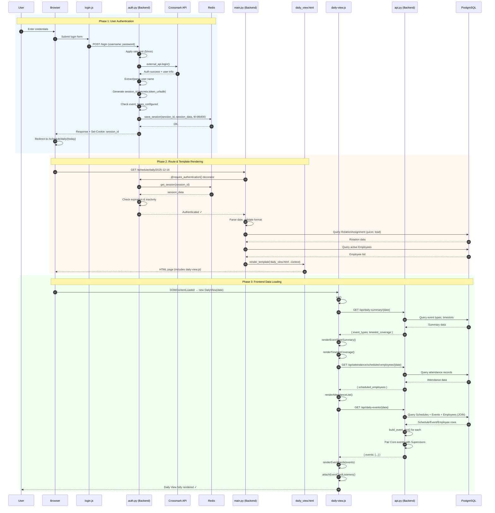
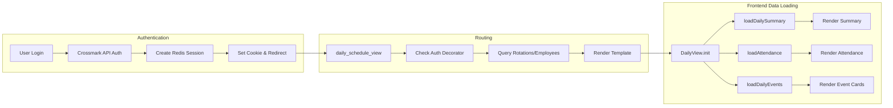

# Daily View Data Flow - Sequence Diagram

This diagram shows the complete flow from user authentication to the daily schedule view being fully rendered with data.

## Main Sequence Diagram

## Simplified Overview

## Key Functions Reference

| Step | Function | File | Description |
|------|----------|------|-------------|
| 1 | `login()` | auth.py | POST /login - authenticate with Crossmark |
| 2 | `save_session()` | auth.py | Store session in Redis (24h TTL) |
| 3 | `daily_schedule_view()` | main.py | GET /schedule/daily/{date} |
| 4 | `require_authentication()` | auth.py | Decorator to validate session |
| 5 | `DailyView.init()` | daily-view.js | Initialize and load all data |
| 6 | `loadDailySummary()` | daily-view.js | Fetch /api/daily-summary |
| 7 | `loadAttendance()` | daily-view.js | Fetch /api/attendance/scheduled-employees |
| 8 | `loadDailyEvents()` | daily-view.js | Fetch /api/daily-events |
| 9 | `get_daily_events()` | api.py | Query and parse event data |
| 10 | `renderEventCards()` | daily-view.js | Generate event card HTML |
