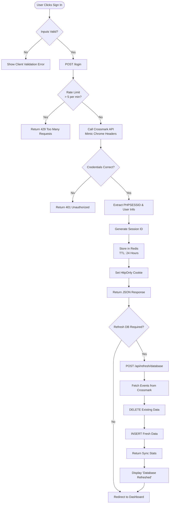

```mermaid
flowchart TD
    Start([User Clicks Sign In]) --> Validation{Inputs Valid?}
    
    Validation -- No --> ClientError[Show Client Validation Error]
    Validation -- Yes --> POSTLogin[POST /login]
    
    POSTLogin --> RateLimit{Rate Limit<br/>> 5 per min?}
    RateLimit -- Yes --> RateError[Return 429 Too Many Requests]
    RateLimit -- No --> ExtAuth[Call Crossmark API<br/>Mimic Chrome Headers]
    
    ExtAuth --> AuthCheck{Credentials Correct?}
    AuthCheck -- No --> AuthFail[Return 401 Unauthorized]
    
    AuthCheck -- Yes --> ExtractData[Extract PHPSESSID & User Info]
    ExtractData --> GenSession[Generate Session ID]
    GenSession --> StoreRedis[Store in Redis<br/>TTL: 24 Hours]
    StoreRedis --> SetCookie[Set HttpOnly Cookie]
    SetCookie --> ReturnSuccess[Return JSON Response]
    
    ReturnSuccess --> FrontendCheck{Refresh DB Required?}
    
    FrontendCheck -- No --> Redirect[Redirect to Dashboard]
    
    FrontendCheck -- Yes --> TriggerRefresh[POST /api/refresh/database]
    TriggerRefresh --> FetchEvents[Fetch Events from Crossmark]
    FetchEvents --> ClearDB[DELETE Existing Data]
    ClearDB --> InsertDB[INSERT Fresh Data]
    InsertDB --> ReturnStats[Return Sync Stats]
    ReturnStats --> DisplayStats[Display 'Database Refreshed']
    DisplayStats --> Redirect
```
