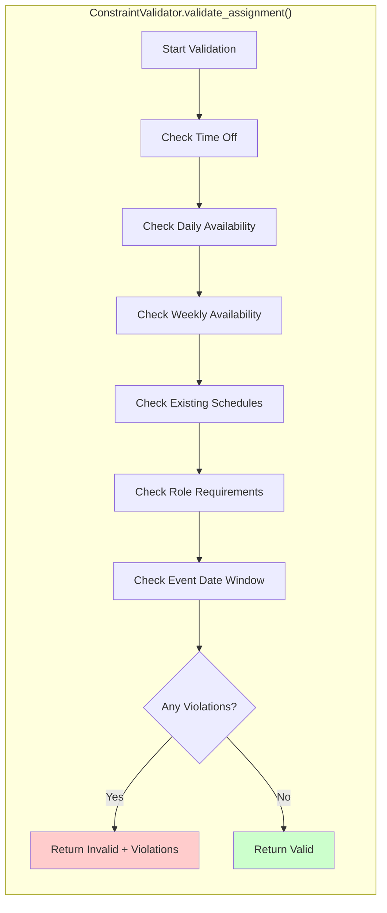

# Reschedule Event Flow - Sequence Diagram

This diagram shows what happens when a user clicks the "Reschedule" button on an event card.

## Main Sequence Diagram

```mermaid
sequenceDiagram
    autonumber
    participant User
    participant EventCard as Event Card (DOM)
    participant DailyView as daily-view.js
    participant Modal as Reschedule Modal
    participant api.py as api.py (Backend)
    participant Validator as ConstraintValidator
    participant CrossmarkAPI as Crossmark API
    participant Database as PostgreSQL

    %% ========================
    %% PHASE 1: Click & Extract Data
    %% ========================
    rect rgb(255, 248, 240)
        Note over User, DailyView: Phase 1: Button Click & Data Extraction
        User->>EventCard: Click "Reschedule" button
        EventCard->>DailyView: handleReschedule(scheduleId)
        
        DailyView->>EventCard: Query data-schedule-id
        DailyView->>EventCard: Query data-event-id
        DailyView->>EventCard: Query data-event-type
        DailyView->>EventCard: Query data-employee-id
        DailyView->>EventCard: Extract employee name, time from DOM
        
        DailyView->>DailyView: Store rescheduleContext
    end

    %% ========================
    %% PHASE 2: Open & Populate Modal
    %% ========================
    rect rgb(240, 248, 255)
        Note over DailyView, api.py: Phase 2: Open Modal & Load Options
        DailyView->>Modal: openRescheduleModal(scheduleId, eventId, ...)
        
        Modal->>Modal: Pre-fill schedule-id (hidden)
        Modal->>Modal: Pre-fill event info display
        Modal->>Modal: Pre-fill date with current date
        Modal->>Modal: Convert time to 24h, pre-fill
        
        DailyView->>api.py: GET /api/event-allowed-times/{eventType}
        api.py-->>DailyView: { allowed_times: ["09:45", "10:30", ...] }
        DailyView->>Modal: Populate time dropdown
        
        DailyView->>api.py: GET /api/available-employees/{date}/{eventType}
        api.py-->>DailyView: { employees: [...] }
        DailyView->>Modal: Populate employee dropdown
        
        Modal->>Modal: Reset override checkbox
        Modal-->>User: Display modal
    end

    %% ========================
    %% PHASE 3: User Input
    %% ========================
    rect rgb(255, 255, 240)
        Note over User, Modal: Phase 3: User Selects New Date/Time
        User->>Modal: Select new date
        User->>Modal: Select new time
        User->>Modal: (Optional) Select different employee
        User->>Modal: Click "Reschedule Event"
    end

    %% ========================
    %% PHASE 4: API Validation & Execution
    %% ========================
    rect rgb(240, 255, 240)
        Note over Modal, Database: Phase 4: Backend Validation & Execution
        Modal->>api.py: POST /api/event/{schedule_id}/reschedule
        Note right of Modal: { new_date, new_time, override_conflicts? }
        
        api.py->>api.py: Validate required fields
        api.py->>Database: Query Schedule by ID
        Database-->>api.py: Schedule record
        
        alt Schedule not found
            api.py-->>Modal: 404 Schedule not found
        end
        
        api.py->>Database: Query Event by ref_num
        api.py->>Database: Query Employee by ID
        Database-->>api.py: Event + Employee
        
        api.py->>api.py: Parse date/time → datetime
        
        %% Constraint Validation
        api.py->>Validator: validate_assignment(event, employee, datetime)
        
        Validator->>Validator: Check time_off conflicts
        Validator->>Validator: Check availability windows
        Validator->>Validator: Check weekly availability patterns
        Validator->>Validator: Check existing schedule conflicts
        Validator->>Validator: Check role/training requirements
        Validator-->>api.py: ValidationResult
        
        alt Conflicts found & no override
            api.py-->>Modal: 409 Conflict { conflicts: [...] }
            Modal->>Modal: displayConflicts(conflicts)
            Modal-->>User: Show conflict warnings
        end
    end

    %% ========================
    %% PHASE 5: External API & Database Update
    %% ========================
    rect rgb(248, 240, 255)
        Note over api.py, Database: Phase 5: Crossmark Sync & DB Update
        api.py->>api.py: Validate external IDs (rep_id, mplan_id, location_id)
        
        alt Missing external IDs
            api.py-->>Modal: 400 Missing Crossmark ID
        end
        
        api.py->>CrossmarkAPI: ensure_authenticated()
        CrossmarkAPI-->>api.py: Authenticated
        
        api.py->>CrossmarkAPI: schedule_mplan_event(rep_id, mplan_id, ...)
        Note right of api.py: Submit BEFORE local DB update
        
        alt API failure
            CrossmarkAPI-->>api.py: Error response
            api.py-->>Modal: 500 Failed to submit to Crossmark
        end
        
        CrossmarkAPI-->>api.py: Success
        
        %% Database transaction
        api.py->>Database: BEGIN NESTED TRANSACTION
        api.py->>Database: UPDATE schedule.schedule_datetime
        api.py->>Database: UPDATE event.sync_status = 'synced'
        
        %% Core-Supervisor auto-reschedule
        api.py->>api.py: is_core_event_redesign(event)?
        
        alt Is CORE event with paired Supervisor
            api.py->>api.py: get_supervisor_status(event)
            api.py->>Database: Find Supervisor schedule
            api.py->>api.py: Calculate supervisor_time = core_start + 2h
            api.py->>CrossmarkAPI: schedule_mplan_event (Supervisor)
            CrossmarkAPI-->>api.py: Success
            api.py->>Database: UPDATE supervisor_schedule.datetime
        end
        
        api.py->>Database: COMMIT
        Database-->>api.py: OK
        
        api.py-->>Modal: 200 Success { message, supervisor_rescheduled? }
    end

    %% ========================
    %% PHASE 6: Frontend Success
    %% ========================
    rect rgb(240, 255, 248)
        Note over Modal, User: Phase 6: Success Handling
        Modal->>Modal: showNotification("Event rescheduled successfully")
        Modal->>Modal: close()
        Modal->>Browser: setTimeout → location.reload()
        Browser-->>User: Page refreshed with updated data ✓
    end
```



## Validation Decision Flow

```mermaid
flowchart TD
    A[POST /api/event/{id}/reschedule] --> B{Schedule exists?}
    B -->|No| C[404 Not Found]
    B -->|Yes| D{Event & Employee exist?}
    D -->|No| E[404 Not Found]
    D -->|Yes| F{Date/Time valid format?}
    F -->|No| G[400 Invalid format]
    F -->|Yes| H[ConstraintValidator.validate_assignment]
    
    H --> I{Conflicts found?}
    I -->|Yes| J{Override flag set?}
    J -->|No| K[409 Conflict Response]
    J -->|Yes| L[Continue with warning]
    I -->|No| L
    
    L --> M{External IDs valid?}
    M -->|No| N[400 Missing Crossmark ID]
    M -->|Yes| O[Crossmark API: schedule_mplan_event]
    
    O --> P{API Success?}
    P -->|No| Q[500 API Error]
    P -->|Yes| R[Update Local Database]
    
    R --> S{Is CORE event?}
    S -->|Yes| T[Auto-reschedule Supervisor +2h]
    S -->|No| U[Commit Transaction]
    T --> U
    
    U --> V[200 Success Response]
    
    style K fill:#ffcccc
    style C fill:#ffcccc
    style E fill:#ffcccc
    style G fill:#ffcccc
    style N fill:#ffcccc
    style Q fill:#ffcccc
    style V fill:#ccffcc
```

## Constraint Validator Checks



## Key Verification Steps

| Step | Check | Error Code | Error Message |
|------|-------|------------|---------------|
| 1 | Required fields present | 400 | "Missing required fields: new_date and new_time" |
| 2 | Schedule exists | 404 | "Schedule not found" |
| 3 | Event exists | 404 | "Event not found" |
| 4 | Employee exists | 404 | "Employee not found" |
| 5 | Date/time format valid | 400 | "Invalid date or time format" |
| 6 | Constraint validation | 409 | "Reschedule would create conflicts" |
| 7 | Crossmark employee ID | 400 | "Missing Crossmark employee ID" |
| 8 | Crossmark event ID | 400 | "Missing Crossmark event ID" |
| 9 | Crossmark location ID | 400 | "Missing Crossmark location ID" |
| 10 | Crossmark authentication | 500 | "Failed to authenticate with Crossmark API" |
| 11 | Crossmark API submission | 500 | "Failed to submit to Crossmark" |

## Key Functions Reference

| Function | File | Purpose |
|----------|------|---------|
| `handleReschedule(scheduleId)` | daily-view.js | Extract event data, initiate modal |
| `openRescheduleModal(...)` | daily-view.js | Setup and display modal |
| `setupTimeRestrictions()` | daily-view.js | Fetch allowed times for event type |
| `loadAvailableEmployeesForReschedule()` | daily-view.js | Fetch qualified employees |
| `reschedule_event_with_validation()` | api.py | Main backend endpoint |
| `ConstraintValidator.validate_assignment()` | constraint_validator.py | Check all scheduling constraints |
| `external_api.schedule_mplan_event()` | session_api_service.py | Submit to Crossmark API |
| `is_core_event_redesign()` | event_helpers.py | Check if event is CORE type |
| `get_supervisor_status()` | event_helpers.py | Find paired Supervisor event |
